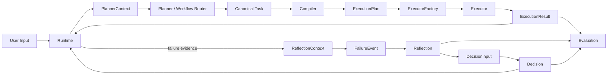
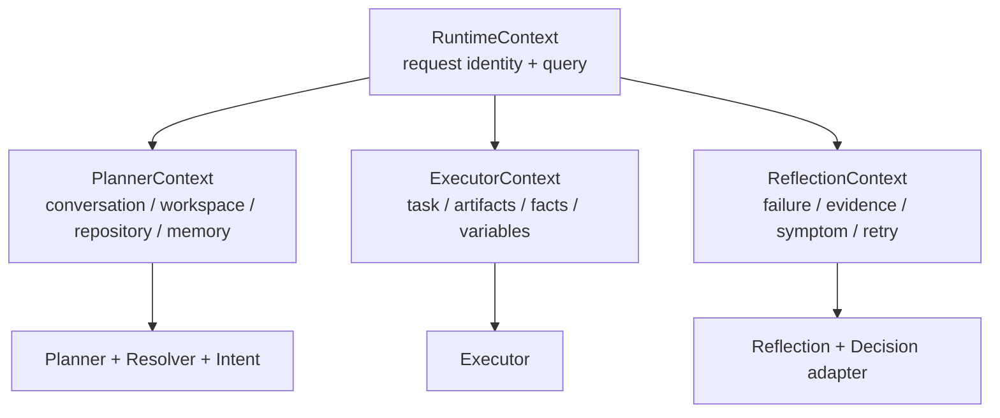
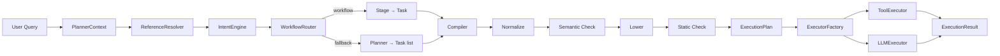
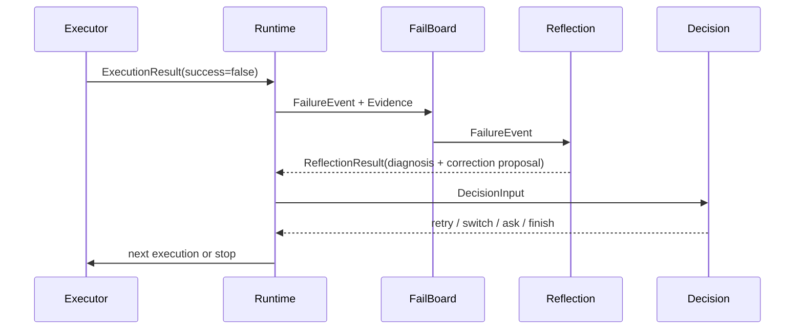
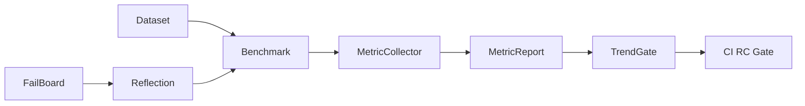
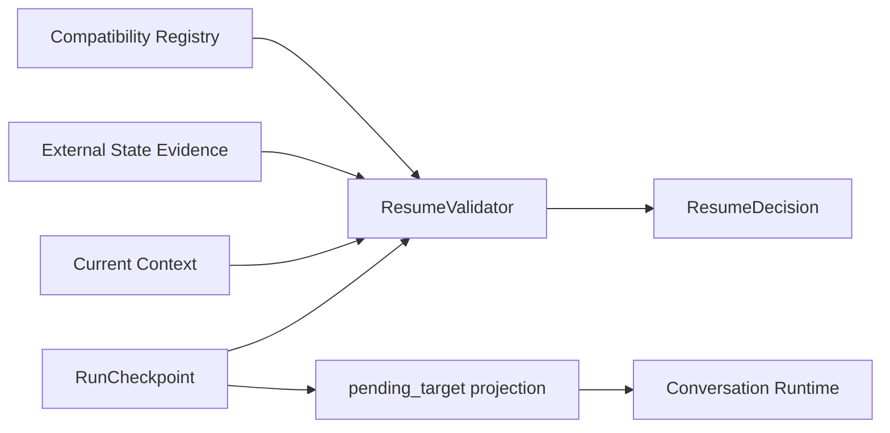
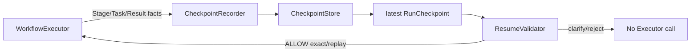
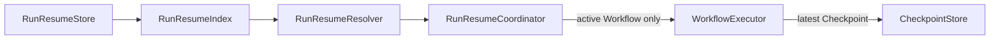

# TSAgent v2.0 RC Architecture

本文是 v2.0 RC 的架构总览。它描述当前实际运行链，不把兼容入口、历史 ADR
或未来 v2.1 设计混入主流程。

## 1. 核心执行链



核心不变量：

1. `Task` 是唯一任务模型。
2. `ExecutionPlan` 是 Executor 唯一的计划输入。
3. `ExecutionResult` 是所有执行器的统一输出。
4. Orchestrator 只通过 `ExecutorFactory` 路由。
5. Reflection 只接收结构化 `FailureEvent`；Decision 只接收 `DecisionInput`。

## 2. Runtime 与 Context 边界

`ExecutionContext` 是 Runtime 内部的可变容器，保存执行过程中的 artifacts、facts、
budget、variables 和历史记录。它不是跨层共享的 God Context。



Context 规则：

- `PlannerContext` 是 `CognitiveContext` 的窄视图子类型，保持 Resolver Contract 不变。
- `ExecutorContext` 和 `ReflectionContext` 是只读快照，不是新的状态存储。
- Runtime 负责把可变容器投影成阶段视图；阶段模块不能反向读取 `AgentState`。
- `AgentState` 只是 Runtime Cache / serialized projection，不是新的 Source of Truth。

实现入口：

- `agent/context/contracts.py`
- `agent/workflow/context.py`
- `agent/orchestrator/context_builder.py`

## 3. Planner、Compiler 与 Executor



Compiler 是纯 lowering 层：

- 不读取用户历史、不调用 LLM、不修复非法 Task。
- `target_type=file/symbol` 必须有合法目标。
- tool plan 必须通过工具存在性、SSA 输出和变量依赖检查。
- `text/none` 任务进入 `LLMExecutor`，不进入确定性工具链。

旧 ReAct 适配器已从 v2.0 runtime 删除；所有任务都经过统一的
`Task → ExecutionPlan → ExecutorFactory → ExecutionResult` 链路。

## 4. Failure → Reflection → Decision



Reflection 不执行 correction；它只提出 Proposal。Decision 是确定性 Policy +
Confidence Gate，不读取完整用户上下文，也不启动新的 Agent Loop。

## 5. Evaluation 与发布门禁



统一 Metrics 管线：

```text
MetricDefinition
        ↓
MetricCollector
        ↓
MetricReport
        ↓
MetricReporter / TrendGate
```

`MetricsV1`、`MetricsV2` 作为稳定报告 facade；新增指标不得创建 `metrics_v3.py`，
应先注册 `MetricDefinition` 并明确 capability、方向和趋势规则。

## 6. v2.0 RC 门禁

本地与 CI 使用同一组离线门禁：

```bash
python -m pytest -q tests --ignore=tests/test_tools_execution.py
python -m pytest -q tests/test_tools_execution.py -k "not web_search and not web_fetch"
python evaluation/benchmark/contract_verification.py
python evaluation/architecture_verification.py
python evaluation/benchmark/eval_reflection.py
python evaluation/benchmark/eval_decision.py
python evaluation/benchmark/trend_gate.py
```

依赖重建：

```bash
python3 -m venv .venv
.venv/bin/python -m pip install -r requirements-lock.txt
```

锁文件当前基于 Python 3.12.7 / macOS arm64 生成；跨平台发布前应在目标平台重新
生成对应锁文件或升级为带平台 markers 的 uv lock。

## 7. RC 阶段暂不做的事情

- 不新增 Capability、Tool、Resolver 或 Prompt。
- 不引入 Multi-Agent。
- 不开启 Replay、REST/SDK、AST/LSP 等 v2.1 Runtime Evolution。
- 不扩大 `AgentState` 责任，不把 Runtime Cache 重新升级为领域模型。

## 8. v2.2A Run Checkpoint Contract

v2.2A 将可恢复执行的事实从零散 Runtime evidence 收敛为不可变
`RunCheckpoint` 链。它是 Runtime 的事实边界，不是新的 Orchestrator：



边界规则：

- `RunCheckpoint` 只记录不可变事实；每次状态变化创建新的 parent-linked snapshot。
- `ResumeDisposition`（Allow / Clarification / Reject）与 `ResumeAction` 分离。
- `ResumeValidator` 只消费结构化当前事实，不查询文件、API、数据库或 Tool。
- `pending_target` 只能由 Checkpoint 单向投影，不能反向重建 Run。
- v2.2A 只冻结 schema、codec、lifecycle、compatibility、validator 和 Oracle；
  Workflow Runtime 接入属于 v2.2B，跨 Workflow 寻址属于 v2.2C。

## 9. v2.2B Single-Workflow Resume Runtime

v2.2B 通过可选的 `WorkflowCheckpointRequest` 将 Checkpoint 接入现有
`WorkflowExecutor`，不新增 Resume Orchestrator：



运行时边界：

- Stage 完成、显式中断、可恢复失败和最终完成均追加不可变 Checkpoint。
- `completed_stage_ids` 是恢复时的安全边界；已确认完成的 Stage 不得再次执行。
- `RESUME_EXACT` 和通过幂等声明校验的 `REPLAY_FROM_STAGE` 才能进入现有
  WorkflowExecutor；`REPLAN_FROM_CHECKPOINT` 留给后续 Planner Bridge。
- v2.2B 当前提供内存 Store 和单 Workflow 集成验证；跨 Run/跨 Workflow Resume
  属于 v2.2C。

v2.0 RC 的目标不是功能更多，而是：依赖可复现、边界可解释、门禁可自动执行、
真实 Demo 可验收，并最终能够安全打 `v2.0.0` Tag。

## 10. v2.2C Run-Level Workflow Resume

当前 v2.2C-A 生产边界位于 `agent/run_resume/`：



Run-level index 只保存 Workflow 顺序、完成/active/pending 投影、依赖和 Artifact
摘要；Stage/Task 事实仍由 `RunCheckpoint` 管理。Coordinator 在调用
`WorkflowExecutor` 之前，必须先通过 Store 原子提交 pending→active；激活提交后即使
尚未生成 checkpoint，重启也只能恢复这个 active Workflow。每个 Workflow 在
CheckpointStore 中使用独立的 `(run_id, workflow_id)` 追加链，避免 A 的最后一个
checkpoint 成为 B 的初始 parent。Coordinator 不能绕过 v2.2B `ResumeValidator`，也不会
重新执行已完成 Workflow。离线 A→B→C E2E 已验证依赖 Artifact、重启恢复、终态收口和
exactly-once 执行边界；并发/分布式恢复与真实 Provider smoke 仍不在当前切片。
