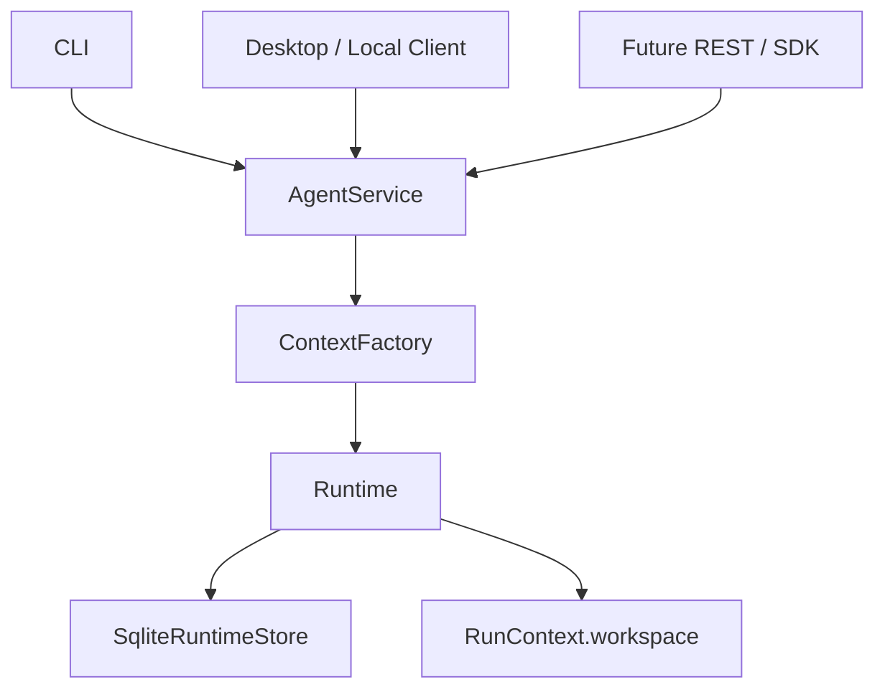
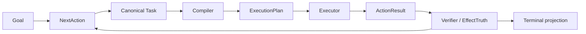
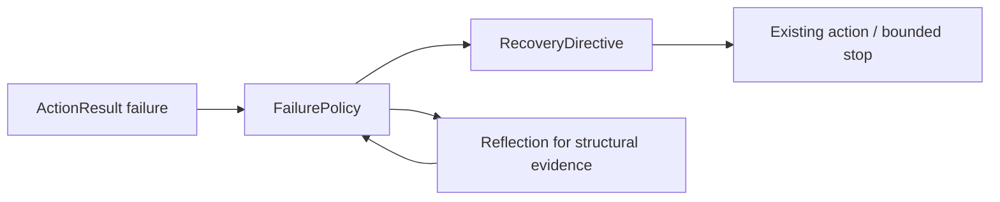

# TSAgent Current Architecture

本文描述当前生产主链。历史阶段和已废弃设计保留在
[docs/adr/](adr/) 中，不在这里作为当前行为宣传。

## 1. 对外服务边界



`AgentService` 是 CLI、桌面端和未来传输适配器的唯一公开运行入口。它负责请求身份、
Context 生命周期、DTO 投影和 Service error；不直接执行 Tool、修改 SQLite 或决定
ResumeAction。

公开请求显式携带 `tenant_id`、`user_id`、`session_id`、`request_id`，查询边界是
`tenant_id + run_id`。内部 `Task`、Checkpoint、Planner state 和 SQLite row 不泄漏到公开
DTO。

## 2. State ownership

```text
ApplicationContext
├── provider/configuration
├── immutable shared resources
└── service factories

SessionContext
├── session identity
├── conversation state
└── scoped memory view

RunContext
├── run_id / workspace
├── artifact service / event source
├── checkpoint and resume views
├── cancellation token
└── diagnostics / clock
```

可变状态必须属于明确的 Application、Session 或 Run scope。文件工具、Artifact projection
和 Verifier 统一使用 `RunContext.workspace`；不得读取 process-global workspace 或当前
工作目录作为事实来源。`close()` 释放进程内资源，但不删除可恢复的 durable 状态。

## 3. Runtime spine



Planner 只产生 canonical `Task`；Compiler 负责确定性 lowering；Executor 只消费
`ExecutionPlan`。`ActionResult` 区分机器可验证事实和模型可读投影，终态只能由 verified
goal/effect/artifact/output evidence 决定。

用户要求的外部动作没有 verified evidence 时，不能产生成功声明或 `COMPLETED`。需要最新
资料的请求必须有 fresh source evidence；没有来源时进入明确的 blocked/failed 状态。

## 4. Failure 与恢复



普通 action failure 是结构化 observation，由已有动作和预算决定是否有限重试。结构性
失败才进入 `FailurePolicy`；Reflection 只提供诊断/建议，不执行 correction，也不创建
第二套 Planner loop。未知 Tool、权限越界、状态损坏和预算耗尽必须快速失败或阻塞。

## 5. Durable facts

`SqliteRuntimeStore` 是生产事实源，覆盖：

- Run head、revision、writer fence 和 idempotency ledger；
- Workflow checkpoint 与 Run-level resume index；
- Artifact metadata、verified effect 和 finalization bundle；
- Durable event stream、cursor 和 terminal event；
- Cancellation / timeout intent 与 `RunOutput`。

文件内容仍位于对应 Run workspace，并通过 canonical reference、digest 和 Verifier 关联到
SQLite 事实。进程重启后由 Store、workspace 和 Service Context 重新构建状态；本地 registry
不能成为 Source of Truth。

## 6. Resume、Cancellation 与事件

已完成 Workflow 不重跑；active Workflow 通过 v2.2B/v2.2C 的 checkpoint lineage 恢复。
恢复前先验证 identity、revision、fence、依赖 Artifact 和外部状态。

取消链是 durable 的：

```text
ACTIVE → CANCELLING → CANCELLED
                 └──→ TIMED_OUT
```

客户端断开、窗口关闭或事件流停止消费不会隐式取消 Run。事件按 Run 内单调序号持久化，
客户端可以用 `after_sequence` 重连；终态 Snapshot 与 terminal event 必须一致。

## 7. Planner Capability baseline

v2.4A 的 Planner 合同、Dataset 和 Oracle 位于：

```text
agent/planner/              metrics / acceptance policy
evals/planner/dataset.json  50-case frozen Dataset
evals/planner/oracle.py     deterministic structural/goal Oracle
```

Golden self-check 只证明 Dataset 与 Oracle 一致，不代表真实 Planner 能力通过。后续真实
Planner acceptance 必须保留 Provider、模型、prompt hash、fixture hash、raw plan 和
latency，并与 Runtime Correctness 分层报告。

## 8. Compatibility boundary

`agent/compat/`（若存在）和历史 evaluation adapter 只能服务明确标记的迁移或旧测试。
生产 Runtime 不得将 global singleton、JSON adapter 或 Evaluation 包作为默认事实源。

任何新增 Runtime 能力必须先补 ADR、Dataset、Oracle 和边界测试，再进入实现。
