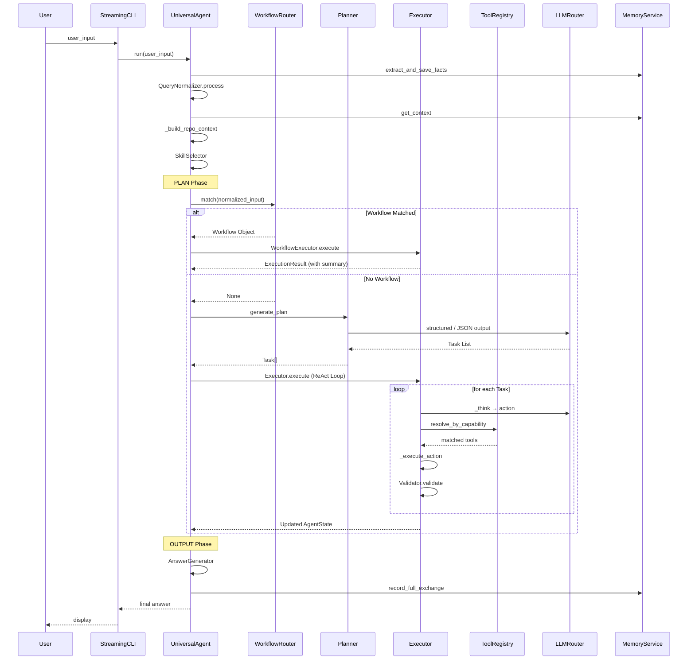

# TSAgent Architecture

> Architecture Diagram & Design Review
> Based on exhaustive codebase analysis of `agent/*` and runtime flow.

---

## 1. 架构总览 (V2)

```mermaid
graph TB
    classDef runtime fill:#1a1a2e,stroke:#e94560,stroke-width:2px,color:#fff
    classDef orchestrator fill:#16213e,stroke:#0f3460,stroke-width:2px,color:#fff
    classDef component fill:#0f3460,stroke:#e94560,stroke-width:1px,color:#fff
    classDef service fill:#533483,stroke:#e94560,stroke-width:1px,color:#fff
    classDef tool fill:#0f3460,stroke:#00b4d8,stroke-width:1px,color:#fff
    classDef infra fill:#1a1a2e,stroke:#00b4d8,stroke-width:1px,color:#e0e0e0
    classDef llm fill:#2d1b3d,stroke:#e94560,stroke-width:2px,color:#fff

    subgraph Entry["入口层 main.py"]
        CLI[StreamingCLI<br/>终端事件可视化]
        MA[Event Loop<br/>user_input / exit]
    end

    subgraph Boot["引导层 bootstrap.py"]
        BOOT[bootstrap.load_all]
        TLOAD[自动发现 tools/* → ToolRegistry]
        SLOAD[自动发现 skills/* → SkillRegistry]
        WLOAD[自动发现 workflows/* → WorkflowRegistry]
    end

    subgraph Runtime["Runtime 状态机 UniversalAgent.run()"]
        INIT["INIT"] -->|"Build AgentState"| PLAN
        PLAN["PLAN<br/>路由 + 规划"] --> EXECUTE
        EXECUTE["EXECUTE<br/>执行"] --> CHECK["CHECK_RESULT"]
        CHECK -->|全部成功| FINISH["FINISH<br/>Output"]
        CHECK -->|部分失败| REPLAN["REPLAN<br/>max=2"]
        REPLAN --> PLAN
        CHECK -->|retries>=2| FAIL["FAIL"]

        RT_RESP["Runtime 当前职责:<br/>① 状态迁移<br/>② 调用 Orchestrator 逻辑<br/>③ Memory 更新 / Event 发出"]
    end

    subgraph PlanPhase["PLAN 阶段"]
        QN[QueryNormalizer<br/>时间/地点归一化]
        MC[Memory Context<br/>三层记忆汇聚]
        RC[Repository Context<br/>代码仓库检索]
        SK[Skill Selector<br/>技能选择 → system_prompt]
        WR[Workflow Router<br/>Embedding + LLM 二级路由]
        PL[Planner<br/>纯 Goal 分解<br/>→ Task 列表(DAG)]
    end

    subgraph ExecutePhase["EXECUTE 阶段"]
        WF_EXEC[Workflow Executor<br/>workflow_executor.py]
        REACT_EXEC[ReAct Executor<br/>executor.py]
        DAG[DAG Scheduler<br/>resolve_dag → 并行批次]
        THINK[Think<br/>LLM 决定 action]
        ACT[Execute Action<br/>ToolResolver]
        OBS[Observation<br/>结果聚合 + Validator]
    end

    subgraph ExecutorRegistry["ExecutorRegistry<br/>agent/executor/"]
        LLME[LLMExecutor<br/>纯 LLM 推理]
        TOOLE[ToolExecutor<br/>单次工具调用]
        REACTE[ReactExecutor<br/>局部 ReAct]
        WFE[WorkflowExecutor<br/>Pipeline 引擎]
    end

    subgraph ToolLayer["工具与能力层"]
        TR[ToolRegistry<br/>按 capability tag 注册<br/>resolve_by_capability]
        FS[filesystem<br/>read/write/list]
        SH[shell<br/>命令执行]
        PY[python<br/>代码执行]
        WEB[web<br/>搜索/爬取]
        OFF[office<br/>文档生成]
        MEMT[memory<br/>记忆工具]
        PATCH[patch<br/>代码补丁]
    end

    subgraph LLMLayer["LLM 抽象层 llm.py"]
        LR[LLMRouter]
        DS[DeepSeek API<br/>deepseek-v4-flash]
        OL[Ollama 本地<br/>qwen3:8b 降级]
        LR --> DS
        LR -.->|失败降级| OL
    end

    subgraph Memory["三层记忆系统 agent/memory/"]
        L1[L1 Session<br/>内存会话]
        L2[L2 Short-Term<br/>持久化 + 自动压缩]
        L3[L3 Long-Term<br/>ChromaDB 语义检索]
        FACTS[User Facts<br/>SQLite 存储]
        PREFS[Preferences<br/>用户偏好]
    end

    subgraph Services["服务层 agent/services/"]
        MS[MemoryService<br/>get_context]
        WS[WorkflowService<br/>注册/查询]
        TS[ToolService<br/>工具执行]
        ES[EventService<br/>事件]
        AS[ArtifactService<br/>产物管理]
        CS[ContextService<br/>Prompt 构建]
        RS[RepositoryService<br/>代码索引]
    end

    subgraph WorkflowDef["工作流定义 workflows/"]
        CG[code_generation<br/>读题→设计→编码→验证]
        BF[bug_fix<br/>Bug 分析→修复]
        CR[code_review<br/>代码审查]
        FD[feature_dev<br/>功能开发]
        RSCH[research<br/>调研]
    end

    subgraph Output["输出阶段"]
        AG[AnswerGenerator<br/>最终答案生成]
        MEM_COMMIT[Memory Commit<br/>写入三层记忆]
    end

    %% 数据流
    CLI --> BOOT --> MA
    MA -->|UniversalAgent.run| Runtime
    Runtime -->|PLAN| PlanPhase
    Runtime -->|EXECUTE| ExecutePhase
    Runtime -->|NEXT_TASK| Output

    PlanPhase -->|Task 列表 / Workflow| ExecutePhase

    WR -->|命中 Workflow| WF_EXEC
    WR -->|未命中| PL --> REACT_EXEC
    REACT_EXEC --> DAG --> THINK --> ACT --> OBS
    WF_EXEC --> ExecutorRegistry

    ACT --> ToolLayer
    ExecutorRegistry --> ToolLayer

    THINK & PL & WF_EXEC --> LLMLayer

    PlanPhase --> Memory
    Output --> Memory

    Memory --> Services
    Services --> PlanPhase

    ToolLayer --> TR

    WorkflowDef -->|注册| WFE

    Output --> AG
    AG --> MEM_COMMIT

    class CLI,MA infra
    class BOOT,TLOAD,SLOAD,WLOAD infra
    class INIT,PLAN,EXECUTE,CHECK,FINISH,REPLAN,FAIL,RT_RESP runtime
    class QN,MC,RC,SK,WR,PL component
    class WF_EXEC,REACT_EXEC,DAG,THINK,ACT,OBS component
    class LLME,TOOLE,REACTE,WFE component
    class TR component
    class FS,SH,PY,WEB,OFF,MEMT,PATCH tool
    class LR,DS,OL llm
    class L1,L2,L3,FACTS,PREFS service
    class MS,WS,TS,ES,AS,CS,RS service
    class CG,BF,CR,FD,RSCH component
    class AG,MEM_COMMIT service
```

---

## 2. 核心数据流

```
User Input
    │
    ▼
QueryNormalizer          ← 时间归一化 / 地点注入
    │
    ▼
MemoryContext Builder    ← Session + Short-Term + Long-Term + Facts
    │
    ▼
Repository Context       ← 代码语义检索 (HuggingFace Embeddings)
    │
    ▼
Skill Selector           ← Embedding 相似度匹配 skill
    │
    ▼
Workflow Router ──[score ≥ 0.75]──→ Workflow Executor
    │                                        │
    │                                   ┌────┴────┐
    │                                   │ Stage 1 │ ← Executor
    │                                   │ Stage 2 │ ← Executor
    │                                   │ Stage 3 │ ← Executor
    │                                   └─────────┘
    │                                        │
    └──[score < 0.45 / no match]──→ Planner ──→ Task List (DAG)
                                                   │
                                              ┌────┴────┐
                                              │ Task A  │ ← ReAct: Think→Act→Observe
                                              │ Task B  │ ← ReAct: Think→Act→Observe
                                              │ Task C  │ ← ReAct: Think→Act→Observe
                                              └─────────┘
                                                   │
                                                   ▼
                                          AnswerGenerator ← 综合 artifacts 生成回答
                                                   │
                                                   ▼
                                          Memory Commit ← 写入三层记忆
```

---

## 3. 路由决策详细逻辑

```
WorkflowRouter.match(user_input)
    │
    ├── Stage 0: 关键词匹配 → 直接返回 Workflow
    │
    ├── Stage 1: Embedding 计算余弦相似度
    │   ┌──────────────┬─────────────┬──────────────────────┐
    │   │ 条件          │ 行为        │ 原因                 │
    │   ├──────────────┼─────────────┼──────────────────────┤
    │   │ score < 0.45 │ → Planner   │ 低置信度，LLM 兜底    │
    │   │ 0.45~0.75   │ → LLM 路由  │ 中置信度，LLM 二级判断 │
    │   │ ≥ 0.75      │ 检查 margin │ 高置信度，但需防模糊   │
    │   │ margin < 0.08│ → LLM 路由  │ Top1-2 过近，LLM 仲裁 │
    │   │ margin ≥ 0.08│ → Workflow  │ 直接返回              │
    │   └──────────────┴─────────────┴──────────────────────┘
    │
    └── Stage 2 (LLM 二级路由): 将 Top-3 候选 + 用户输入送入 LLM 选择
```

---

## 4. 状态机详解 (UniversalAgent.run)

```
                         ┌──────────┐
                         │   INIT   │
                         └────┬─────┘
                              │ build AgentState
                              ▼
                         ┌──────────┐
                     ┌───│   PLAN   │◄────────────────────────────┐
                     │   └────┬─────┘                              │
                     │        │ WorkflowRouter / Planner           │
                     │        ▼                                    │
                     │   ┌──────────┐                              │
                     │   │ EXECUTE  │                              │
                     │   └────┬─────┘                              │
                     │        │ Executor.execute                   │
                     │        ▼                                    │
                     │   ┌────────────┐                            │
                     │   │ TASK_RESULT│     ┌──────────┐            │
                     │   └─────┬──────┘     │  REPLAN  │           │
                     │         │            └────┬─────┘           │
                     │    ┌────┴─────┐          │ replan < 2       │
                     │    │          │          └──────────────────┘
                     │    ▼          ▼
                     │ 全部成功   部分失败
                     │    │          │
                     │    ▼          ▼
                     │ ┌────────┐ ┌────────┐
                     │ │NEXT_TASK│ │RECOVER │
                     │ └────┬───┘ └────┬───┘
                     │      │           │
                     │      ▼           │ replan ≥ 2
                     │ ┌────────┐       │
                     │ │ FINISH │   ┌───▼───┐
                     │ └────────┘   │ FAIL  │
                     │              └───────┘
                     │
                     └── 重试路径（replan_count < 2 时）

关键行为:
- PLAN: 路由到 Workflow → WorkflowExecutor.execute() 直接返回
- PLAN: 路由到 Planner → 生成 Task 列表 → Executor 逐 task 执行
- EXECUTE: DAG 调度器分批并行执行，每批内无依赖关系
- RECOVER: failed task 信息注入 REPLAN，保留 succeeded task 的 Facts
- FINISH: AnswerGenerator 合成最终答案
- FAIL: 即使失败也尽量生成部分答案
```

---

## 5. Executor 执行流程 (ReAct Loop)

```
_execute_task_react(state, task)
    │
    ├── EventService.emit("task_start")
    ├── task.status = "running"
    │
    ├── while iteration < MAX_THINK_ITERATIONS (8):
    │   │
    │   ├── _think(state, task)
    │   │   ├── 构建 tool selection rules (基于 task goal 关键词)
    │   │   ├── ContextService.build_think_prompt(task)
    │   │   └── LLM.ainvoke → 解析 JSON action
    │   │
    │   ├── action == "finish"? → Validator.validate(task)
    │   │   ├── 通过 → task.status = "succeeded" → break
    │   │   └── 不通过 → continue (最多连续 2 次兜底)
    │   │
    │   ├── 解析 capabilities + params + reason
    │   │
    │   ├── _check_install_command (安全拦截)
    │   │
    │   ├── _execute_action(task, capabilities, params)
    │   │   ├── ToolRegistry.resolve_by_capability(capabilities)
    │   │   ├── tool.ainvoke(params)
    │   │   ├── read_file 成功 → _summarize_question (LLM 自动摘要)
    │   │   └── 记录 ArtifactService.put(...)
    │   │
    │   ├── _update_facts(task, observation)
    │   │   ├── read_file → facts["question_loaded"] = True
    │   │   ├── list_directory → facts["directory_listed"] = True
    │   │   └── run_python → facts["code_executed"] = True
    │   │
    │   └── Validator.validate(task)
    │       ├── 通过 → task.status = "succeeded" → break
    │       └── 不通过 → continue
    │
    └── EventService.emit("task_end")
```

---

## 6. Workflow Executor 执行流程

```
WorkflowExecutor.execute(workflow, context)
    │
    ├── workflow.topological_sort() → [stage1, stage2, ...]
    │
    ├── for idx, stage in enumerate(sorted_stages):
    │   │
    │   ├── 检查 required_outputs 是否满足 → 不满足则 skip
    │   │
    │   ├── PromptRegistry.get(workflow.id, stage.id)
    │   │   └── 验证 Prompt 变量都在 stage.inputs / outputs / arguments 声明
    │   │
    │   ├── 渲染 Prompt（注入 Artifact）
    │   │
    │   ├── ExecutorRegistry.get(stage.execution.executor) → 执行
    │   │   └── 重试逻辑 (max_retries + 1)
    │   │
    │   ├── 成功 → 创建 Artifact → context.set_artifact()
    │   ├── 成功 → Validator 验证
    │   └── 失败 → 记录 errors，继续
    │
    └── _build_summary(context) → ExecutionResult
```

---

## 7. 组件交互时序图



---

## 8. AgentState 数据结构

```python
class AgentState(TypedDict):
    # Messages 历史
    messages: Annotated[list[BaseMessage], add_messages]

    # Plan 相关
    plan: Optional[List[Dict]]          # Planner 输出的 Task 列表
    current_task_index: int             # 当前执行索引

    # 产物
    artifacts: Dict[str, Any]           # 关键产出（observations, search_results, last_output）

    # 上下文
    memory_context: Optional[str]       # 短期记忆
    repo_context: Optional[str]         # 代码仓库上下文
    skill_hint: str                     # 技能提示
    retries: int                        # 重试次数
    workflow: Optional[str]             # 当前 Workflow ID
    reflection: Optional[Dict]          # 反思结果
```

---

## 9. Architecture Review 发现

### ⚠️ 问题 ① Runtime 承担了太多职责

**现状**: `runtime.py` 的 `run()` 方法（250 行）同时负责：
- 状态机迁移 (state machine)
- 调用 WorkflowRouter / Planner
- 调用 Executor
- 调用 AnswerGenerator
- Retry / Replan 逻辑
- Memory 更新
- Event 发出

**建议**: 拆出 `Orchestrator` 层，Runtime 只做状态机

### ⚠️ 问题 ② ReAct Executor 依赖 ToolRegistry

**现状**: `executor.py` 直接 `from agent.registry.tool_registry import registry`，执行器知道工具注册中心

**建议**: 加 `ActionResolver` 中间层，Executor 只发 `Action` 收 `Observation`

### ⚠️ 问题 ③ Capability Registry 应独立

**现状**: `ToolRegistry._tags` 把 capability 作为工具标签附带管理

**建议**: 拆出独立 `CapabilityRegistry`，一个 capability 映射到多个工具

### ⚠️ 问题 ④ Artifact 缺少 parent 链

**现状**: `ArtifactService` 的 Artifact 只有 `id / type / summary / uri / visibility`

**建议**: 加入 `parents: Artifact[]`，实现引用追踪

### ⚠️ 问题 ⑤ Workflow 和 Planner 是两套世界

**现状**: Workflow 用 `Stage`，Planner 输出 `Task`，ReAct 用 `Step`——三个不同抽象

**建议**: 统一为 `Node` 抽象，LangGraph / Haystack / CrewAI 都走这个方向

### 📝 补充 1: ExecutionContext

**现状**: `ContextService` 更像 Prompt Builder，没有统一上下文容器

**建议**: 线程所有组件共享 `ExecutionContext { messages, artifacts, memory, budget, vars }`

### 📝 补充 2: BudgetManager

**现状**: ReAct 循环只有 `MAX_THINK_ITERATIONS=8`，没有精细的资源管控

**建议**: 每个 Node/Task 绑定 `BudgetSpec { max_steps, max_tokens, max_cost, deadline }`

---

## 10. 架构成熟度评估

| 版本 | 评分 | 特征 |
|------|------|------|
| ToolDecider (旧) | 6.5/10 | 规则引擎，扩展性有限 |
| **当前 (ReAct + Capability + Artifact)** | **9.0/10** | **现代 Agent 框架核心思想** |
| 加入 Orchestrator/ExecutionContext/Budget | 9.7/10 | 生产级架构 |

> 核心结论：当前架构方向正确，不需要大改 Executor。
> 接下来应聚焦抽象层次收敛 —— Runtime 更薄、能力与工具解耦、统一执行图模型。

---

*Generated: 2026-07-24*
*Based on exhaustive codebase analysis of TSAgent project*