# TSAgent 当前架构、接口与配置地图

> 范围：当前工作树中的 `agent/`、`tools/`、`skills/`、`workflows/`、`main.py`、`apps/desktop/`。测试、Benchmark、fixture 不作为应用 API；Benchmark/脚本环境变量在配置部分单列。私有 `_...` 符号不列入接口表。

## 1. 架构图

### 1.1 模块树

```text
agent/
├── checkpoint/
│   ├── __init__.py
│   ├── codec.py
│   ├── compatibility.py
│   ├── contracts.py
│   ├── lifecycle.py
│   ├── projection.py
│   ├── reason_codes.py
│   ├── recorder.py
│   ├── store.py
│   └── validator.py
├── cognition/
│   ├── __init__.py
│   ├── cognitive_context.py
│   ├── execution_need.py
│   ├── intent_engine.py
│   ├── intent_schema.py
│   └── reference_resolver.py
├── compiler/
│   ├── rules/
│   │   ├── __init__.py
│   │   ├── execute_rule.py
│   │   ├── explain_rule.py
│   │   ├── list_rule.py
│   │   ├── modify_rule.py
│   │   ├── read_rule.py
│   │   ├── resolve_rule.py
│   │   ├── search_rule.py
│   │   └── write_rule.py
│   ├── __init__.py
│   ├── context.py
│   └── tool_selector.py
├── context/
│   ├── __init__.py
│   ├── context_service.py
│   └── contracts.py
├── context_policy.py
├── conversation/
│   ├── __init__.py
│   └── state.py
├── decision/
│   ├── __init__.py
│   └── decision.py
├── executor/
│   ├── executors/
│   │   ├── __init__.py
│   │   ├── tool.py
│   │   └── workflow.py
│   ├── __init__.py
│   ├── contract.py
│   ├── llm_executor.py
│   ├── plan_executor.py
│   └── verifier.py
├── failure/
│   ├── __init__.py
│   ├── contracts.py
│   ├── policy.py
│   └── taxonomy.py
├── grounding/
│   ├── __init__.py
│   ├── context.py
│   └── grounder.py
├── goal.py
├── inbox.py
├── knowledge/
│   ├── __init__.py
│   └── project_knowledge.py
├── memory/
│   ├── __init__.py
│   ├── lifecycle.py
│   ├── long_term.py
│   ├── preference.py
│   ├── repository.py
│   ├── resolution.py
│   ├── session.py
│   └── short_term.py
├── next_action.py
├── orchestrator/
│   ├── __init__.py
│   ├── context_builder.py
│   ├── executor.py
│   ├── finalizer.py
│   ├── main.py
│   └── planner.py
├── planner/
│   ├── __init__.py
│   ├── constraint_extractor.py
│   ├── planner.py
│   └── schemas.py
├── prompts/
│   └── workflow/
│       ├── code_generation/
│       │   ├── design_algorithm.txt
│       │   ├── generate_code.txt
│       │   ├── read_question.txt
│       │   └── verify_code.txt
│       └── __init__.py
├── reflection/
│   ├── __init__.py
│   └── reflector.py
├── registry/
│   ├── capability_registry.py
│   ├── skill_registry.py
│   ├── tool_registry.py
│   └── workflow_registry.py
├── repository/
│   ├── __init__.py
│   └── indexer.py
├── router/
│   ├── __init__.py
│   ├── skill_router.py
│   └── workflow_router.py
├── run_resume/
│   ├── __init__.py
│   ├── codec.py
│   ├── contracts.py
│   ├── coordinator.py
│   ├── resolver.py
│   └── store.py
├── services/
│   ├── __init__.py
│   ├── artifact_service.py
│   ├── memory_service.py
│   ├── repository_service.py
│   ├── tool_service.py
│   └── workspace_service.py
├── task/
│   └── __init__.py
├── validators/
│   ├── __init__.py
│   ├── file_exists.py
│   ├── min_length.py
│   └── python_syntax.py
├── workflow/
│   ├── __init__.py
│   ├── argument.py
│   ├── artifact.py
│   ├── budget.py
│   ├── context.py
│   ├── execution.py
│   ├── executor_type.py
│   ├── hydration.py
│   ├── result.py
│   ├── stage.py
│   ├── tool_policy.py
│   ├── tool_result.py
│   └── workflow.py
├── workspace/
│   ├── __init__.py
│   ├── cache.py
│   ├── index.py
│   ├── manager.py
│   ├── matcher.py
│   ├── resolver.py
│   └── workspace.py
├── .DS_Store
├── __init__.py
├── answer_generator.py
├── api.py
├── bootstrap.py
├── diagnostics.py
├── embeddings.py
├── event_bus.py
├── llm.py
├── query_normalizer.py
├── runtime.py
├── runtime_context.py
├── runtime_budget.py
├── sandbox.py
├── security.py
├── session_runtime.py
└── state.py
apps/
└── desktop/
    ├── src/
    │   ├── mocks/
    │   │   └── runData.ts
    │   ├── App.tsx
    │   ├── main.tsx
    │   ├── styles.css
    │   ├── types.ts
    │   └── vite-env.d.ts
    ├── .gitignore
    ├── README.md
    ├── index.html
    ├── package.json
    ├── tsconfig.json
    └── vite.config.ts
main.py
└── main.py
skills/
├── __init__.py
├── chat.py
├── coding.py
├── research.py
└── workflow.py
tools/
├── __init__.py
├── filesystem.py
├── memory.py
├── meta.py
├── office.py
├── patch.py
├── python.py
├── shell.py
├── web.py
└── workflow.py
workflows/
└── code_generation.py
```

### 1.2 调用关系与数据流

```mermaid
flowchart LR
    UI["CLI / Desktop UI"] --> API["TSAgent / SessionRuntime"]
    API --> APP["ApplicationContext"]
    APP --> SES["SessionContext"]
    SES --> RUN["RunContext"]
    RUN --> RT["UniversalAgent Runtime"]
    RT --> ORCH["ExecutionOrchestrator"]
    ORCH --> CTX["ContextBuilder"]
    CTX --> COG["Cognition / ReferenceResolver"]
    COG --> INT["IntentEngine"]
    INT --> ROUTE["WorkflowRouter / Planner"]
    ROUTE --> TASK["Canonical Task"]
    TASK --> COMP["Compiler / Rules"]
    COMP --> PLAN["ExecutionPlan"]
    PLAN --> FACTORY["ExecutorFactory"]
    FACTORY --> TOOL["ToolExecutor"]
    FACTORY --> LLM["LLMExecutor"]
    FACTORY --> WF["WorkflowExecutor"]
    TOOL --> RESULT["ExecutionResult"]
    LLM --> RESULT
    WF --> RESULT
    RESULT --> VERIFY["Verifier / Artifact"]
    VERIFY --> AR["ActionResult"]
    AR --> GOAL["GoalVerifier / NextAction"]
    GOAL --> RT
    RT --> FP["FailurePolicy"]
    FP --> REF["Reflection → Decision"]
    REF --> RT
    RT --> BUDGET["RunBudget"]
    RUN --> EVENT["Run-scoped EventBus"]
    RUN --> ART["Run-scoped ArtifactStore"]
    SES --> MEM["Memory / Conversation"]
    CTX --> WS["Workspace / Repository"]
    WF --> CP["Checkpoint / Run Resume"]
    CP --> STORE["CheckpointStore / RunResumeStore"]
```



### 1.3 核心调用链

```text
请求
└── TSAgent / SessionRuntime
    └── ApplicationContext
        └── SessionContext
            └── RunContext
                └── UniversalAgent.run()
                    ├── Memory / Repository context
                    ├── Cognition / ReferenceResolver
                    ├── IntentEngine
                    ├── WorkflowRouter 或 Planner
                    ├── Task.from_dict / canonical Task
                    ├── Compiler.compile(Task, CompilerContext)
                    ├── ExecutorFactory.get(plan.executor)
                    ├── Tool / LLM / Workflow executor
                    ├── ExecutionResult → ActionResult → GoalVerifier / NextAction
                    ├── Structural FailureEvent → FailurePolicy → Reflection → Decision
                    ├── One RunBudget for transitions / recoveries / time
                    └── Finalizer → answer + memory
```

## 2. 接口清单

### 2.1 稳定集成入口

| 模块 | 接口 | 输入 | 返回值 | 说明 |
|---|---|---|---|---|
| `agent` | `TSAgent` | `user_id: str = "default"` | `TSAgent` | 主 facade；`.run(user_input: str) -> str` |
| `agent` | `SessionRuntime.create` | `session_id`, `user_id`, `persistent` | `SessionRuntime` | 创建会话 |
| `agent` | `SessionRuntime.run` | `user_input`, 可选 `run_id` | `str` | 执行请求 |
| `agent` | `SessionRuntime.start_run` | `run_id`, workspace、request、Store | `RunContext` | 创建逻辑 Run |
| `agent` | `SessionRuntime.resume_run` | `run_id`, workspace、request、Store | `RunContext` | 恢复/绑定逻辑 Run |
| `agent` | `SessionRuntime.reset/destroy` | 生命周期选项 | `MemoryResetReport / None` | 清理会话/运行资源 |
| `agent.goal` | `GoalVerifier.verify` | `AgentState`, final answer | `CompletionDecision` | 只依据机器证据决定是否允许完成 |
| `agent.action_result` | `ActionResult` | action value / error evidence | immutable result | 机器真值与用户投影分离 |
| `agent.failure` | `FailurePolicy.resolve` | structural `FailureFact`, Runtime state | `RecoveryDirective` | 唯一 Reflection / Decision 生产入口 |
| `agent.runtime_budget` | `RunBudget` | per-run limits | bounded counters | 统一 transitions / goal rounds / recoveries / time |

### 2.2 模块级公开函数（完整）

| 模块 | 函数 | 输入参数 | 返回值 |
|---|---|---|---|
| `agent/answer_generator.py:36` | `generate_final_answer` (async) | `async (state, user_input: str)` | `str` |
| `agent/bootstrap.py:54` | `init_workspace` (sync) | `()` | `None` |
| `agent/bootstrap.py:70` | `build_knowledge` (sync) | `()` | `None` |
| `agent/bootstrap.py:81` | `init_repository_async` (async) | `async ()` | `None` |
| `agent/bootstrap.py:104` | `load_all_tools` (sync) | `()` | `未标注` |
| `agent/bootstrap.py:112` | `load_all_skills` (sync) | `()` | `未标注` |
| `agent/bootstrap.py:120` | `load_all_workflows` (sync) | `()` | `未标注` |
| `agent/bootstrap.py:129` | `load_all` (sync) | `()` | `未标注` |
| `agent/bootstrap.py:143` | `load_all_async` (async) | `async ()` | `未标注` |
| `agent/bootstrap.py:148` | `get_timings` (sync) | `()` | `dict` |
| `agent/bootstrap.py:153` | `print_timings` (sync) | `()` | `未标注` |
| `agent/checkpoint/codec.py:16` | `serialize_checkpoint` (sync) | `(checkpoint: RunCheckpoint)` | `str` |
| `agent/checkpoint/codec.py:26` | `deserialize_checkpoint` (sync) | `(payload: str | bytes | Mapping[str, Any], *, expected_schema_version: str = '1.0')` | `RunCheckpoint` |
| `agent/checkpoint/codec.py:52` | `checkpoint_digest` (sync) | `(checkpoint: RunCheckpoint)` | `str` |
| `agent/checkpoint/compatibility.py:11` | `major_version` (sync) | `(version: str)` | `int | None` |
| `agent/checkpoint/compatibility.py:72` | `assess_compatibility` (sync) | `(checkpoint: RunCheckpoint, context: ResumeContext, registry: CompatibilityRegistry)` | `CompatibilityAssessment` |
| `agent/checkpoint/lifecycle.py:45` | `allowed_transition` (sync) | `(current: CheckpointStatus | str, target: CheckpointStatus | str)` | `bool` |
| `agent/checkpoint/lifecycle.py:54` | `validate_transition` (sync) | `(current: CheckpointStatus | str, target: CheckpointStatus | str)` | `None` |
| `agent/checkpoint/lifecycle.py:64` | `advance_checkpoint` (sync) | `(checkpoint: RunCheckpoint, target_status: CheckpointStatus | str, *, checkpoint_id: str, updated_at: str, **changes)` | `RunCheckpoint` |
| `agent/checkpoint/lifecycle.py:101` | `append_checkpoint` (sync) | `(checkpoint: RunCheckpoint, *, checkpoint_id: str, updated_at: str, status: CheckpointStatus | str | None = None, **changes)` | `RunCheckpoint` |
| `agent/checkpoint/lifecycle.py:146` | `lifecycle_contract` (sync) | `()` | `dict[str, list[str]]` |
| `agent/checkpoint/projection.py:32` | `project_pending_target` (sync) | `(checkpoint: RunCheckpoint)` | `PendingTarget | None` |
| `agent/checkpoint/recorder.py:38` | `utc_timestamp` (sync) | `()` | `str` |
| `agent/checkpoint/recorder.py:43` | `new_checkpoint_id` (sync) | `(prefix: str)` | `str` |
| `agent/checkpoint/recorder.py:47` | `json_fact` (sync) | `(value: Any)` | `Any` |
| `agent/checkpoint/recorder.py:66` | `fact_digest` (sync) | `(value: Any)` | `str` |
| `agent/checkpoint/recorder.py:76` | `snapshot_artifacts` (sync) | `(artifacts: Iterable[Any])` | `tuple[ArtifactSnapshot, ...]` |
| `agent/checkpoint/recorder.py:98` | `effect_state_for_task` (sync) | `(task_verb: str, *, success: bool, metadata: Mapping[str, Any] | None = None)` | `SideEffectState` |
| `agent/checkpoint/recorder.py:117` | `failure_snapshot` (sync) | `(*, event_id: str, stage_id: str, error: str, metadata: Mapping[str, Any] | None = None)` | `FailureEventSnapshot` |
| `agent/checkpoint/recorder.py:409` | `checkpoint_result_metadata` (sync) | `(checkpoint: RunCheckpoint | None, decision: ResumeDecision | None = None)` | `dict[str, Any]` |
| `agent/checkpoint/validator.py:134` | `validate_resume` (sync) | `(checkpoint: RunCheckpoint, current_context: ResumeContext, external_state_evidence: Iterable[ExternalStateGuard] | None = None, compatibility_registry: CompatibilityRegistry | None = None)` | `ResumeDecision` |
| `agent/cognition/execution_need.py:34` | `analyze_execution_need` (sync) | `(text: str)` | `Optional[bool]` |
| `agent/conversation/state.py:144` | `classify_conversation_intent` (sync) | `(intent: Optional[object], user_input: str, *, runtime_pending: bool = False)` | `ConversationIntent` |
| `agent/conversation/state.py:305` | `render_snapshot` (sync) | `(snapshot: ConversationSnapshot)` | `str` |
| `agent/conversation/state.py:341` | `resolve_reference_type` (sync) | `(intent: Optional[object])` | `ReferenceType` |
| `agent/conversation/state.py:352` | `render_reference` (sync) | `(snapshot: ConversationSnapshot, ref_type: ReferenceType)` | `str` |
| `agent/decision/decision.py:147` | `decide` (sync) | `(inp: DecisionInput)` | `Tuple[Decision, DecisionTrace]` |
| `agent/diagnostics.py:54` | `strict_contracts_enabled` (sync) | `()` | `bool` |
| `agent/diagnostics.py:59` | `record_contract_violation` (sync) | `(*, boundary: str, operation: str, expected: str, error: Exception, event_bus_instance: Optional[EventBus] = None, diagnostics: Optional[list[Any]] = None)` | `未标注` |
| `agent/diagnostics.py:107` | `handle_contract_violation` (sync) | `(*, boundary: str, operation: str, expected: str, error: Exception, event_bus_instance: Optional[EventBus] = None, diagnostics: Optional[list[Any]] = None)` | `未标注` |
| `agent/diagnostics.py:132` | `get_contract_violations` (sync) | `()` | `List[object]` |
| `agent/diagnostics.py:136` | `clear_contract_violations` (sync) | `()` | `None` |
| `agent/embeddings.py:9` | `allow_model_downloads` (sync) | `()` | `bool` |
| `agent/embeddings.py:17` | `get_embedding` (sync) | `()` | `未标注` |
| `agent/executor/verifier.py:43` | `verify_write` (sync) | `(path: str, *, min_size: int = 1, expect_content: Optional[str] = None)` | `bool` |
| `agent/executor/verifier.py:63` | `verify_absent` (sync) | `(path: str)` | `bool` |
| `agent/executor/verifier.py:68` | `verify_updated` (sync) | `(path: str, original_mtime_ns: Optional[int], original_size: Optional[int])` | `bool` |
| `agent/memory/long_term.py:42` | `store_summary` (sync) | `(user_id: str, summary: str)` | `None` |
| `agent/memory/long_term.py:62` | `retrieve_summaries` (sync) | `(user_id: str, query: str, k: int = 5)` | `str` |
| `agent/memory/long_term.py:92` | `retrieve_all_summaries` (sync) | `(user_id: str)` | `list[str]` |
| `agent/memory/long_term.py:138` | `save_fact` (sync) | `(user_id: str, category: str, key: str, value: str)` | `None` |
| `agent/memory/long_term.py:151` | `get_facts` (sync) | `(user_id: str)` | `dict[str, dict[str, str]]` |
| `agent/memory/long_term.py:168` | `get_facts_text` (sync) | `(user_id: str)` | `str` |
| `agent/memory/long_term.py:184` | `clear_summaries` (sync) | `(user_id: str)` | `None` |
| `agent/memory/long_term.py:192` | `clear_facts` (sync) | `(user_id: str)` | `None` |
| `agent/memory/long_term.py:201` | `clear_all` (sync) | `(user_id: str)` | `None` |
| `agent/memory/preference.py:63` | `extract_facts_with_llm` (async) | `async (text: str)` | `dict` |
| `agent/memory/preference.py:126` | `async_extract_and_save_facts` (async) | `async (user_id: str, text: str)` | `dict` |
| `agent/memory/resolution.py:56` | `record_resolution` (sync) | `(user_id: str, utterance: str, resolved_target: str, kind: str, metadata: dict = None)` | `None` |
| `agent/memory/resolution.py:80` | `get_resolutions` (sync) | `(user_id: str, n: int = 20)` | `list` |
| `agent/memory/resolution.py:85` | `clear_resolutions` (sync) | `(user_id: str)` | `None` |
| `agent/memory/session.py:15` | `ensure_session` (sync) | `(user_id: str)` | `None` |
| `agent/memory/session.py:25` | `add_message` (sync) | `(user_id: str, role: str, content: str)` | `None` |
| `agent/memory/session.py:46` | `add_user_message` (sync) | `(user_id: str, content: str)` | `None` |
| `agent/memory/session.py:54` | `add_assistant_message` (sync) | `(user_id: str, content: str)` | `None` |
| `agent/memory/session.py:59` | `get_session_context` (sync) | `(user_id: str, n: int = 10)` | `str` |
| `agent/memory/session.py:91` | `get_last_topic` (sync) | `(user_id: str)` | `str` |
| `agent/memory/session.py:97` | `clear_session` (sync) | `(user_id: str)` | `None` |
| `agent/memory/session.py:102` | `get_message_count` (sync) | `(user_id: str)` | `int` |
| `agent/memory/short_term.py:49` | `add_exchange` (sync) | `(user_id: str, user_input: str, assistant_response: str)` | `None` |
| `agent/memory/short_term.py:70` | `compress_history` (async) | `async (user_id: str, entries: list[dict])` | `str` |
| `agent/memory/short_term.py:130` | `get_history` (sync) | `(user_id: str, n: int | None = None)` | `str` |
| `agent/memory/short_term.py:155` | `get_latest_exchanges` (sync) | `(user_id: str, n: int = 3)` | `Optional[str]` |
| `agent/memory/short_term.py:160` | `clear_history` (sync) | `(user_id: str)` | `None` |
| `agent/planner/constraint_extractor.py:37` | `extract_constraints` (sync) | `(user_input: str)` | `List[dict]` |
| `agent/planner/constraint_extractor.py:66` | `detect_abstention` (sync) | `(user_input: str, grounding = None, repo_context: str = '')` | `bool` |
| `agent/planner/planner.py:137` | `plan_with_metadata` (async) | `async (user_input: str, memory_context: str = '', repo_context: str = '', skill_hint: str = '', intent = None, grounding = None)` | `PlanOutput` |
| `agent/reflection/reflector.py:100` | `diagnose` (sync) | `(event: FailureEvent)` | `Diagnosis` |
| `agent/reflection/reflector.py:130` | `correction_strategy` (sync) | `(diagnosis: Diagnosis)` | `Correction` |
| `agent/reflection/reflector.py:140` | `reflect` (sync) | `(event: FailureEvent)` | `ReflectionResult` |
| `agent/reflection/reflector.py:154` | `reflect_context` (sync) | `(context: ReflectionContext)` | `ReflectionResult` |
| `agent/registry/capability_registry.py:126` | `register_default_capabilities` (sync) | `()` | `未标注` |
| `agent/repository/indexer.py:291` | `set_repository_indexer` (sync) | `(indexer: RepositoryIndexer)` | `None` |
| `agent/repository/indexer.py:296` | `get_repository_indexer` (sync) | `()` | `Optional[RepositoryIndexer]` |
| `agent/run_resume/codec.py:15` | `serialize_run_index` (sync) | `(index: RunResumeIndex)` | `str` |
| `agent/run_resume/codec.py:24` | `deserialize_run_index` (sync) | `(payload: str | bytes | Mapping[str, Any])` | `RunResumeIndex` |
| `agent/run_resume/codec.py:37` | `run_index_digest` (sync) | `(index: RunResumeIndex)` | `str` |
| `agent/sandbox.py:49` | `local_execution_allowed` (sync) | `()` | `bool` |
| `agent/sandbox.py:162` | `run_in_sandbox` (sync) | `(cmd: str, timeout: int = DEFAULT_TIMEOUT)` | `str` |
| `agent/security.py:27` | `is_sensitive_path` (sync) | `(path: str | Path)` | `bool` |
| `agent/security.py:59` | `redact_sensitive_text` (sync) | `(text: str)` | `str` |
| `agent/security.py:70` | `is_sensitive_command` (sync) | `(command: str)` | `bool` |
| `agent/services/workspace_service.py:148` | `get_workspace_service` (sync) | `()` | `WorkspaceService` |
| `agent/services/workspace_service.py:155` | `set_workspace_service` (sync) | `(service: WorkspaceService)` | `None` |
| `agent/workflow/hydration.py:84` | `hydrate_checkpoint_artifacts` (sync) | `(snapshots: Iterable[object], context: ExecutionContext)` | `ArtifactHydrationReport` |
| `agent/workflow/hydration.py:112` | `hydrate_run_artifacts` (sync) | `(artifacts: Iterable[object], context: ExecutionContext)` | `ArtifactHydrationReport` |
| `agent/workflow/hydration.py:137` | `hydrate_declared_file_inputs` (sync) | `(stage: object, snapshots: Iterable[object], context: ExecutionContext)` | `ArtifactHydrationReport` |
| `agent/workspace/matcher.py:9` | `match_filename` (sync) | `(name: str, candidates: list[Path])` | `list[PathMatch]` |
| `main.py:69` | `main` (async) | `async ()` | `未标注` |
| `tools/filesystem.py:53` | `get_working_directory` (sync) | `()` | `str` |
| `tools/filesystem.py:58` | `set_working_directory` (sync) | `(path: str)` | `str` |
| `tools/filesystem.py:206` | `read_file` (sync) | `(path: str)` | `str` |
| `tools/filesystem.py:296` | `write_file` (sync) | `(path: str, content: str, mode: str = 'overwrite')` | `str` |
| `tools/filesystem.py:343` | `list_directory` (sync) | `(path: str = '.')` | `str` |
| `tools/filesystem.py:381` | `find_file` (sync) | `(name: str)` | `str` |
| `tools/filesystem.py:427` | `clear_path_cache` (sync) | `()` | `str` |
| `tools/memory.py:11` | `query_memory` (sync) | `(query: str, k: int = 5, user_id: str = 'default')` | `str` |
| `tools/memory.py:50` | `get_user_preference` (sync) | `(user_id: str = 'default')` | `str` |
| `tools/memory.py:73` | `save_fact` (sync) | `(fact: str, user_id: str = 'default')` | `str` |
| `tools/memory.py:96` | `get_session_info` (sync) | `(user_id: str = 'default')` | `str` |
| `tools/meta.py:6` | `list_all_tools` (sync) | `()` | `str` |
| `tools/meta.py:44` | `get_tool_info` (sync) | `(name: str)` | `str` |
| `tools/office.py:54` | `create_pptx` (sync) | `(title: str, slides: list, theme: str = 'modern', output_path: str = '')` | `str` |
| `tools/office.py:345` | `create_docx` (sync) | `(title: str, sections: list, output_path: str = '')` | `str` |
| `tools/patch.py:12` | `propose_patch` (sync) | `(diff: str)` | `str` |
| `tools/patch.py:23` | `apply_patch` (sync) | `(patch_path: str)` | `str` |
| `tools/python.py:26` | `run_python` (sync) | `(code: str, timeout: int = 10)` | `str` |
| `tools/python.py:66` | `run_python_file` (sync) | `(path: str, timeout: int = 10)` | `str` |
| `tools/shell.py:11` | `shell` (sync) | `(cmd: str, timeout: int = 30)` | `str` |
| `tools/web.py:251` | `web_search` (async) | `async (query: str = '', q: str = '', url: str = '', keyword: str = '', search: str = '', max_results: int = 5, timeliness: str = 'any')` | `str` |
| `tools/web.py:296` | `web_news_search` (async) | `async (query: str, max_results: int = 5, days: int = 7)` | `str` |
| `tools/web.py:368` | `web_deep_search` (async) | `async (query: str, fetch_top_n: int = 2, timeliness: str = 'any')` | `str` |
| `tools/web.py:445` | `web_fetch` (async) | `async (url: str)` | `str` |
| `tools/workflow.py:10` | `list_workflows` (sync) | `()` | `str` |
| `tools/workflow.py:34` | `get_workflow` (sync) | `(name: str)` | `str` |
| `tools/workflow.py:54` | `run_workflow` (sync) | `(name: str, input_text: str = '')` | `str` |

> 共列出 126 个模块级公开函数；私有函数、测试函数和 Benchmark 函数不在此表。

### 2.3 公开类 / Protocol / 数据模型及其公开方法

| 模块 | 类型 | 构造输入 | 公开方法（输入 → 返回值） |
|---|---|---|---|
| `agent/api.py:10` | `TSAgent` | `(self, user_id: str = 'default')` | `property user_id(self) → str`<br>`runasync (self, user_input: str) → str` |
| `agent/checkpoint/codec.py:12` | `CheckpointCodecError` | `默认构造（模型字段或无参构造）` | — |
| `agent/checkpoint/compatibility.py:18` | `WorkflowMigration` | `默认构造（模型字段或无参构造）` | `matches(self, workflow_id: str, from_version: str, to_version: str) → bool` |
| `agent/checkpoint/compatibility.py:33` | `CompatibilityRegistry` | `默认构造（模型字段或无参构造）` | `migration_for(self, workflow_id: str, from_version: str, to_version: str) → WorkflowMigration \| None` |
| `agent/checkpoint/compatibility.py:59` | `CompatibilityAssessment` | `默认构造（模型字段或无参构造）` | — |
| `agent/checkpoint/contracts.py:67` | `RuntimeEvidence` | `默认构造（模型字段或无参构造）` | `to_dict(self) → dict[str, str]`<br>`from_dict(cls, value: Mapping[str, Any]) → 'RuntimeEvidence'` |
| `agent/checkpoint/contracts.py:100` | `ExternalStateGuard` | `默认构造（模型字段或无参构造）` | `to_dict(self) → dict[str, str]`<br>`from_dict(cls, value: Mapping[str, Any]) → 'ExternalStateGuard'` |
| `agent/checkpoint/contracts.py:136` | `TaskEffectRecord` | `默认构造（模型字段或无参构造）` | `to_dict(self) → dict[str, Any]`<br>`from_dict(cls, value: Mapping[str, Any]) → 'TaskEffectRecord'` |
| `agent/checkpoint/contracts.py:189` | `ArtifactSnapshot` | `默认构造（模型字段或无参构造）` | `to_dict(self) → dict[str, Any]`<br>`from_dict(cls, value: Mapping[str, Any]) → 'ArtifactSnapshot'` |
| `agent/checkpoint/contracts.py:228` | `FailureEventSnapshot` | `默认构造（模型字段或无参构造）` | `to_dict(self) → dict[str, Any]`<br>`from_dict(cls, value: Mapping[str, Any]) → 'FailureEventSnapshot'` |
| `agent/checkpoint/contracts.py:272` | `ResumeContext` | `默认构造（模型字段或无参构造）` | `to_dict(self) → dict[str, Any]`<br>`from_dict(cls, value: Mapping[str, Any]) → 'ResumeContext'` |
| `agent/checkpoint/contracts.py:346` | `RunCheckpoint` | `默认构造（模型字段或无参构造）` | `to_dict(self) → dict[str, Any]`<br>`from_dict(cls, value: Mapping[str, Any]) → 'RunCheckpoint'` |
| `agent/checkpoint/contracts.py:577` | `ResumeDecision` | `默认构造（模型字段或无参构造）` | `to_dict(self) → dict[str, Any]` |
| `agent/checkpoint/lifecycle.py:41` | `InvalidCheckpointTransition` | `默认构造（模型字段或无参构造）` | — |
| `agent/checkpoint/projection.py:11` | `PendingTarget` | `默认构造（模型字段或无参构造）` | `to_dict(self) → dict[str, str]` |
| `agent/checkpoint/reason_codes.py:6` | `CheckpointStatus` | `默认构造（模型字段或无参构造）` | — |
| `agent/checkpoint/reason_codes.py:17` | `ResumeDisposition` | `默认构造（模型字段或无参构造）` | — |
| `agent/checkpoint/reason_codes.py:23` | `ResumeAction` | `默认构造（模型字段或无参构造）` | — |
| `agent/checkpoint/reason_codes.py:30` | `SideEffectState` | `默认构造（模型字段或无参构造）` | — |
| `agent/checkpoint/reason_codes.py:41` | `GuardStatus` | `默认构造（模型字段或无参构造）` | — |
| `agent/checkpoint/reason_codes.py:48` | `ResumeReasonCode` | `默认构造（模型字段或无参构造）` | — |
| `agent/checkpoint/recorder.py:142` | `WorkflowCheckpointRequest` | `默认构造（模型字段或无参构造）` | — |
| `agent/checkpoint/recorder.py:182` | `CheckpointRecorder` | `(self, request: WorkflowCheckpointRequest)` | `start(self, *, workflow_id: str, workflow_version: str, active_stage_id: str, active_task_id: str, execution_plan: Mapping[str, Any], target_summary: str = '', activation_attempt_id: str = '') → RunCheckpoint`<br>`resume(self, decision: ResumeDecision) → RunCheckpoint`<br>`record_stage(self, *, stage_id: str, task_id: str, execution_plan: Mapping[str, Any], success: bool, result_error: str, result_metadata: Mapping[str, Any] \| None, task_verb: str, next_stage_id: str, next_task_id: str, artifacts: Iterable[Any], target_summary: str = '') → RunCheckpoint`<br>`suspend(self, *, reason: str = 'explicit_interruption') → RunCheckpoint`<br>`complete(self, *, artifacts: Iterable[Any], summary: str = '') → RunCheckpoint` |
| `agent/checkpoint/store.py:17` | `CheckpointStoreError` | `默认构造（模型字段或无参构造）` | — |
| `agent/checkpoint/store.py:22` | `CheckpointStore` | `默认构造（模型字段或无参构造）` | `save(self, checkpoint: RunCheckpoint) → RunCheckpoint`<br>`get(self, checkpoint_id: str) → RunCheckpoint \| None`<br>`latest(self, run_id: str) → RunCheckpoint \| None`<br>`latest_for_workflow(self, run_id: str, workflow_id: str, *, activation_attempt_id: str = '') → RunCheckpoint \| None`<br>`history(self, run_id: str) → tuple[RunCheckpoint, ...]` |
| `agent/checkpoint/store.py:47` | `InMemoryCheckpointStore` | `(self)` | `save(self, checkpoint: RunCheckpoint) → RunCheckpoint`<br>`get(self, checkpoint_id: str) → RunCheckpoint \| None`<br>`latest(self, run_id: str) → RunCheckpoint \| None`<br>`latest_for_workflow(self, run_id: str, workflow_id: str, *, activation_attempt_id: str = '') → RunCheckpoint \| None`<br>`history(self, run_id: str) → tuple[RunCheckpoint, ...]` |
| `agent/cognition/cognitive_context.py:18` | `ResolutionCandidate` | `默认构造（模型字段或无参构造）` | `to_resolved_query(self, raw: str) → 'ResolvedQuery'` |
| `agent/cognition/cognitive_context.py:44` | `ResolutionResult` | `默认构造（模型字段或无参构造）` | `property resolution_trace(self) → str`<br>`property has_target(self) → bool`<br>`property entities(self) → list`<br>`to_resolved_query(self) → 'ResolvedQuery'`<br>`to_json(self) → dict` |
| `agent/cognition/cognitive_context.py:100` | `ResolutionTimeline` | `(self, maxlen: int = 15)` | `push(self, result: ResolutionResult) → None`<br>`latest(self) → Optional[ResolutionResult]`<br>`history(self) → list`<br>`iter_reverse(self) → 未标注`<br>`clear(self) → None` |
| `agent/cognition/cognitive_context.py:139` | `ConversationState` | `默认构造（模型字段或无参构造）` | `record(self, result: ResolutionResult) → None` |
| `agent/cognition/cognitive_context.py:154` | `ResolvedQuery` | `默认构造（模型字段或无参构造）` | `property has_target(self) → bool`<br>`property has_symbol(self) → bool` |
| `agent/cognition/cognitive_context.py:183` | `CognitiveContext` | `默认构造（模型字段或无参构造）` | `property current_file(self) → Optional[str]`<br>`property current_symbol(self) → Optional[str]`<br>`property last_file(self) → Optional[str]`<br>`property last_symbol(self) → Optional[str]`<br>`property last_target(self) → Optional[str]`<br>`short_summary(self) → str` |
| `agent/cognition/cognitive_context.py:298` | `PlannerContext` | `默认构造（模型字段或无参构造）` | — |
| `agent/cognition/intent_engine.py:346` | `IntentEngine` | `(self)` | `analyze(self, context: CognitiveContext) → IntentResult` |
| `agent/cognition/intent_schema.py:50` | `IntentResult` | `默认构造（模型字段或无参构造）` | `property is_chat(self) → bool`<br>`property is_unknown(self) → bool`<br>`property has_target(self) → bool` |
| `agent/cognition/reference_resolver.py:219` | `ReferenceResolver` | `(self)` | `property llm_call_count(self) → int`<br>`resolve(self, user_input: str, context: CognitiveContext) → ResolutionResult`<br>`resolve_symbol(self, text: str, context: CognitiveContext) → ResolutionCandidate`<br>`resolve_unknown(self, text: str, context: CognitiveContext) → ResolutionCandidate`<br>`resolve_candidates(self, text: str, context: CognitiveContext) → list`<br>`resolve_memory(self, text: str, context: CognitiveContext) → ResolutionCandidate`<br>`resolve_capability(self, text: str, context: CognitiveContext) → ResolutionCandidate`<br>`merge_candidates(candidates: list) → ResolutionCandidate` |
| `agent/compiler/context.py:14` | `CompilerContext` | `默认构造（模型字段或无参构造）` | `get_workspace(self) → 未标注`<br>`get_registry(self) → 未标注` |
| `agent/compiler/rules/execute_rule.py:6` | `ExecuteRule` | `默认构造（模型字段或无参构造）` | `property verb(self) → Verb`<br>`matches(self, task: Task) → bool`<br>`build(self, task: Task, **services) → ExecutionPlan` |
| `agent/compiler/rules/explain_rule.py:6` | `ExplainRule` | `默认构造（模型字段或无参构造）` | `property verb(self) → Verb`<br>`matches(self, task: Task) → bool`<br>`build(self, task: Task, **services) → ExecutionPlan` |
| `agent/compiler/rules/list_rule.py:18` | `ListRule` | `默认构造（模型字段或无参构造）` | `property verb(self) → Verb`<br>`matches(self, task: Task) → bool`<br>`build(self, task: Task, **services) → ExecutionPlan` |
| `agent/compiler/rules/modify_rule.py:6` | `ModifyRule` | `默认构造（模型字段或无参构造）` | `property verb(self) → Verb`<br>`matches(self, task: Task) → bool`<br>`build(self, task: Task, **services) → ExecutionPlan` |
| `agent/compiler/rules/read_rule.py:6` | `ReadRule` | `默认构造（模型字段或无参构造）` | `property verb(self) → Verb`<br>`matches(self, task: Task) → bool`<br>`build(self, task: Task, **services) → ExecutionPlan` |
| `agent/compiler/rules/resolve_rule.py:6` | `ResolveRule` | `默认构造（模型字段或无参构造）` | `property verb(self) → Verb`<br>`matches(self, task: Task) → bool`<br>`build(self, task: Task, **services) → ExecutionPlan` |
| `agent/compiler/rules/search_rule.py:6` | `SearchRule` | `默认构造（模型字段或无参构造）` | `property verb(self) → Verb`<br>`matches(self, task: Task) → bool`<br>`build(self, task: Task, **services) → ExecutionPlan` |
| `agent/compiler/rules/write_rule.py:6` | `WriteRule` | `默认构造（模型字段或无参构造）` | `property verb(self) → Verb`<br>`matches(self, task: Task) → bool`<br>`build(self, task: Task, **services) → ExecutionPlan` |
| `agent/compiler/tool_selector.py:34` | `CompileError` | `默认构造（模型字段或无参构造）` | — |
| `agent/compiler/tool_selector.py:38` | `Rule` | `默认构造（模型字段或无参构造）` | `property verb(self) → Verb`<br>`matches(self, task: Task) → bool`<br>`build(self, task: Task, **services) → ExecutionPlan` |
| `agent/compiler/tool_selector.py:67` | `Compiler` | `(self)` | `add_rule(self, rule: Rule) → None`<br>`compile(self, task: Task, context: Optional[CompilerContext] = None) → ExecutionPlan` |
| `agent/context/context_service.py:18` | `ContextService` | `默认构造（模型字段或无参构造）` | `build_think_prompt(cls, task: Dict, system_prompt: str = '') → List`<br>`build_finish_prompt(cls, task: Dict, final_artifacts: List, original_input: str) → List` |
| `agent/context/contracts.py:30` | `RuntimeContext` | `默认构造（模型字段或无参构造）` | — |
| `agent/context/contracts.py:43` | `ExecutorContext` | `默认构造（模型字段或无参构造）` | — |
| `agent/context/contracts.py:63` | `ReflectionContext` | `默认构造（模型字段或无参构造）` | — |
| `agent/conversation/state.py:22` | `ConversationState` | `默认构造（模型字段或无参构造）` | — |
| `agent/conversation/state.py:33` | `ConversationSnapshot` | `默认构造（模型字段或无参构造）` | — |
| `agent/conversation/state.py:40` | `ReferenceType` | `默认构造（模型字段或无参构造）` | — |
| `agent/conversation/state.py:52` | `ConversationIntent` | `默认构造（模型字段或无参构造）` | — |
| `agent/conversation/state.py:70` | `ConversationEvent` | `默认构造（模型字段或无参构造）` | — |
| `agent/conversation/state.py:80` | `ConversationRetrieverProtocol` | `默认构造（模型字段或无参构造）` | `get(self, user_id: str) → ConversationState`<br>`snapshot(self, user_id: str) → ConversationSnapshot`<br>`runtime_pending(self, user_id: str) → bool`<br>`events(self, user_id: str) → List[ConversationEvent]` |
| `agent/conversation/state.py:188` | `ConversationTracker` | `(self, max_events: int = 50)` | `update(self, *, user_id: str, user_input: str, assistant_answer: str = '', intent: Optional[object] = None, runtime_pending: Optional[bool] = None) → ConversationState`<br>`get_state(self, user_id: str) → ConversationState`<br>`get_events(self, user_id: str) → List[ConversationEvent]`<br>`runtime_pending(self, user_id: str) → bool`<br>`reset(self, user_id: str) → None` |
| `agent/conversation/state.py:276` | `ConversationRetriever` | `(self, tracker: Optional[ConversationTracker] = None)` | `property tracker(self) → ConversationTracker`<br>`get(self, user_id: str) → ConversationState`<br>`snapshot(self, user_id: str) → ConversationSnapshot`<br>`runtime_pending(self, user_id: str) → bool`<br>`events(self, user_id: str) → List[ConversationEvent]` |
| `agent/decision/decision.py:34` | `ExecutionState` | `默认构造（模型字段或无参构造）` | — |
| `agent/decision/decision.py:43` | `Policy` | `默认构造（模型字段或无参构造）` | — |
| `agent/decision/decision.py:69` | `DecisionInput` | `默认构造（模型字段或无参构造）` | `from_reflection_context(cls, context, diagnosis: str, diagnosis_confidence: float) → 'DecisionInput'` |
| `agent/decision/decision.py:106` | `Decision` | `默认构造（模型字段或无参构造）` | — |
| `agent/decision/decision.py:113` | `DecisionTrace` | `默认构造（模型字段或无参构造）` | — |
| `agent/diagnostics.py:24` | `ContractIntegrationError` | `默认构造（模型字段或无参构造）` | — |
| `agent/diagnostics.py:28` | `RunDiagnosticsSink` | `(self, *, scope_id: str)` | `property closed(self) → bool`<br>`append(self, event: Any) → None`<br>`close(self) → None` |
| `agent/event_bus.py:7` | `EventScopeClosedError` | `默认构造（模型字段或无参构造）` | — |
| `agent/event_bus.py:15` | `Subscription` | `(self, bus: 'EventBus', event_type: object, token: int)` | `property closed(self) → bool`<br>`close(self) → None` |
| `agent/event_bus.py:40` | `EventBus` | `(self, *, scope_id: str = '')` | `property closed(self) → bool`<br>`subscribe(self, event_type: object, callback: Callable[[Any], Any]) → Subscription`<br>`unsubscribe(self, event_type: object, token: int) → None`<br>`subscriber_count(self, event_type: Optional[object] = None) → int`<br>`emit(self, event_type: object, data: Any) → int`<br>`close(self) → None` |
| `agent/executor/contract.py:22` | `Executor` | `默认构造（模型字段或无参构造）` | `executeasync (self, target: ExecutionTarget, context: ExecutionContext) → ExecutionResult` |
| `agent/executor/contract.py:36` | `ExecutorFactory` | `默认构造（模型字段或无参构造）` | `register(cls, executor_type: str, executor_cls: type) → None`<br>`get(cls, executor_type: str) → 'Executor'`<br>`registered_types(cls) → list[str]` |
| `agent/executor/executors/tool.py:21` | `ToolExecutor` | `默认构造（模型字段或无参构造）` | `executeasync (self, target: Task, context: ExecutionContext) → ExecutionResult` |
| `agent/executor/executors/workflow.py:50` | `WorkflowExecutor` | `(self)` | `executeasync (self, workflow: Workflow, context: ExecutionContext, *, checkpoint_request: WorkflowCheckpointRequest \| None = None) → ExecutionResult` |
| `agent/executor/llm_executor.py:27` | `LLMExecutor` | `默认构造（模型字段或无参构造）` | `executeasync (self, task: Task, context: Optional[ExecutionContext] = None) → ExecutionResult` |
| `agent/executor/plan_executor.py:26` | `PlanExecutor` | `默认构造（模型字段或无参构造）` | `executeasync (self, plan: ExecutionPlan, workspace: Optional[WorkspaceService] = None) → Dict[str, Any]` |
| `agent/executor/verifier.py:21` | `ExecutionArtifacts` | `默认构造（模型字段或无参构造）` | — |
| `agent/executor/verifier.py:33` | `VerificationResult` | `默认构造（模型字段或无参构造）` | — |
| `agent/executor/verifier.py:86` | `BaseVerification` | `默认构造（模型字段或无参构造）` | `verify(self, artifacts: ExecutionArtifacts, task: Optional[Any] = None) → VerificationResult` |
| `agent/executor/verifier.py:94` | `WriteVerification` | `默认构造（模型字段或无参构造）` | `verify(self, artifacts: ExecutionArtifacts, task: Optional[Any] = None) → VerificationResult` |
| `agent/executor/verifier.py:115` | `DeleteVerification` | `默认构造（模型字段或无参构造）` | `verify(self, artifacts: ExecutionArtifacts, task: Optional[Any] = None) → VerificationResult` |
| `agent/executor/verifier.py:125` | `ExecutionVerifier` | `(self)` | `register(self, verification: BaseVerification) → None`<br>`get(self, name: str) → Optional[BaseVerification]`<br>`verify(self, plan: Any, artifacts: ExecutionArtifacts, task: Optional[Any] = None) → VerificationResult` |
| `agent/grounding/context.py:13` | `Candidate` | `默认构造（模型字段或无参构造）` | `to_dict(self) → dict` |
| `agent/grounding/context.py:43` | `GroundingContext` | `默认构造（模型字段或无参构造）` | `property files(self) → List[Candidate]`<br>`property symbols(self) → List[Candidate]`<br>`top(self, n: int = 5) → List[Candidate]` |
| `agent/grounding/context.py:62` | `GroundingStats` | `默认构造（模型字段或无参构造）` | `to_dict(self) → dict` |
| `agent/grounding/context.py:79` | `GroundingTrace` | `默认构造（模型字段或无参构造）` | `to_dict(self) → dict` |
| `agent/grounding/context.py:102` | `GroundingResult` | `默认构造（模型字段或无参构造）` | — |
| `agent/grounding/context.py:110` | `GroundingBudget` | `默认构造（模型字段或无参构造）` | — |
| `agent/grounding/grounder.py:23` | `GroundingInput` | `默认构造（模型字段或无参构造）` | `retrieval_keys(self) → List[str]` |
| `agent/grounding/grounder.py:60` | `Grounder` | `(self, budget: Optional[GroundingBudget] = None)` | `ground(self, input: GroundingInput) → GroundingResult` |
| `agent/knowledge/project_knowledge.py:14` | `ProjectKnowledge` | `(self)` | `build(self) → None`<br>`property workflows(self) → list[dict]`<br>`property tools(self) → list[dict]`<br>`property skills(self) → list[dict]`<br>`property summary(self) → str` |
| `agent/llm.py:47` | `LLMRouter` | `(self)` | `property supports_structured_output(self) → bool`<br>`disable_structured_output(self) → 未标注`<br>`invoke(self, messages: list[BaseMessage], **kwargs) → 未标注`<br>`ainvokeasync (self, messages: list[BaseMessage], **kwargs) → 未标注`<br>`property status(self) → dict`<br>`bind_tools(self, tools: list) → 未标注` |
| `agent/memory/lifecycle.py:28` | `MemoryResetReport` | `默认构造（模型字段或无参构造）` | — |
| `agent/memory/lifecycle.py:36` | `MemoryRuntime` | `默认构造（模型字段或无参构造）` | `reset(cls, user_id: str, *, conversation: bool = True, facts: bool = False) → MemoryResetReport` |
| `agent/memory/repository.py:3` | `RepositoryMemory` | `默认构造（模型字段或无参构造）` | `search(query: str, k: int = 5) → 未标注`<br>`find_symbol(symbol: str) → 未标注` |
| `agent/memory/resolution.py:24` | `ResolutionMemory` | `默认构造（模型字段或无参构造）` | `to_dict(self) → dict` |
| `agent/orchestrator/context_builder.py:21` | `ContextBuilder` | `(self, orchestrator)` | `build(self, user_input: str, user_id: str, context: dict, repo_context: str, state: AgentState) → PlannerContext`<br>`update_conversation_state(self, intent: IntentResult, resolution = None) → None`<br>`render_context(self, context: dict, now: datetime) → str` |
| `agent/orchestrator/executor.py:18` | `ExecutionStage` | `(self, orchestrator)` | `runasync (self, state: AgentState) → Tuple[AgentState, str]` |
| `agent/orchestrator/finalizer.py:18` | `Finalizer` | `(self, orchestrator)` | `runasync (self, state: AgentState, user_input: str, user_id: str, best_answer: Optional[str] = None) → str` |
| `agent/orchestrator/main.py:30` | `ExecutionOrchestrator` | `(self, *, session_context: Optional[SessionContext] = None)` | `property run_context(self) → Optional[RunContext]`<br>`property session_context(self) → Optional[SessionContext]`<br>`bind_run_context(self, run_context: RunContext) → None`<br>`clear_run_context(self) → None`<br>`reset_timings(self) → 未标注`<br>`get_timings(self) → Dict[str, float]`<br>`planasync (self, user_input: str, user_id: str, context: Dict, repo_context: str, skill_hint: str) → Tuple[AgentState, str, Optional[str]]`<br>`executeasync (self, state: AgentState) → Tuple[AgentState, str]`<br>`replanasync (self, state: AgentState, user_input: str, user_id: str) → Tuple[AgentState, str]`<br>`finalizeasync (self, state: AgentState, user_input: str, user_id: str, best_answer: Optional[str] = None) → str` |
| `agent/orchestrator/planner.py:163` | `PlannerStage` | `(self, orchestrator)` | `runasync (self, user_input: str, user_id: str, context: Dict, repo_context: str, skill_hint: str) → Tuple[AgentState, str, Optional[str]]`<br>`replanasync (self, state: AgentState, user_input: str, user_id: str) → Tuple[AgentState, str]` |
| `agent/planner/planner.py:23` | `PlanOutput` | `默认构造（模型字段或无参构造）` | — |
| `agent/planner/planner.py:39` | `PlannerPromptBuilder` | `默认构造（模型字段或无参构造）` | `render_grounding(grounding) → str`<br>`render_conversation(conversation) → str` |
| `agent/planner/schemas.py:13` | `PlanMetadata` | `默认构造（模型字段或无参构造）` | — |
| `agent/planner/schemas.py:24` | `TaskList` | `默认构造（模型字段或无参构造）` | — |
| `agent/prompts/workflow/__init__.py:8` | `PromptTemplate` | `默认构造（模型字段或无参构造）` | — |
| `agent/prompts/workflow/__init__.py:16` | `PromptRegistry` | `默认构造（模型字段或无参构造）` | `get(cls, workflow_id: str, stage_id: str) → Optional[PromptTemplate]`<br>`render(cls, workflow_id: str, stage_id: str, **kwargs) → str`<br>`render_with_context(cls, workflow_id: str, stage_id: str, artifacts: Dict[str, Any]) → str`<br>`render_parts(cls, workflow_id: str, stage_id: str, artifacts: Dict[str, Any]) → tuple`<br>`clear_cache(cls) → 未标注` |
| `agent/query_normalizer.py:12` | `QueryNormalizer` | `默认构造（模型字段或无参构造）` | `process(user_input: str, user_id: str = '') → str` |
| `agent/reflection/reflector.py:27` | `Diagnosis` | `默认构造（模型字段或无参构造）` | — |
| `agent/reflection/reflector.py:34` | `Correction` | `默认构造（模型字段或无参构造）` | — |
| `agent/reflection/reflector.py:42` | `ReflectionResult` | `默认构造（模型字段或无参构造）` | — |
| `agent/registry/capability_registry.py:14` | `CapabilityResolver` | `(self, capability: str, tool_name: str, priority: int = 0)` | — |
| `agent/registry/capability_registry.py:22` | `CapabilityRegistry` | `(self)` | `register_capability(self, capability: str, tool_name: str, priority: int = 0, description: str = '') → 未标注`<br>`register_resolver(self, capability: str, resolver_fn: Callable[[str], Optional[str]]) → 未标注`<br>`resolve(self, capability: str, context: str = '') → Optional[str]`<br>`resolve_all(self, capability: str, context: str = '') → List[str]`<br>`get_all_capabilities(self) → List[str]`<br>`get_tools_for_capability(self, capability: str) → List[str]`<br>`get_capabilities_for_tool(self, tool_name: str) → List[str]` |
| `agent/registry/skill_registry.py:23` | `Skill` | `(self, name: str, description: str, planner_hint: str = '')` | `property embedding(self) → 未标注`<br>`match(self, query: str, query_embedding: Optional[np.ndarray]) → float`<br>`get_system_prompt(self) → str`<br>`get_workflow(self) → Optional[str]` |
| `agent/registry/skill_registry.py:61` | `SkillRegistry` | `(self)` | `register(self, skill: Skill) → 未标注`<br>`select(self, user_input: str) → Optional[Skill]` |
| `agent/registry/tool_registry.py:13` | `ToolRegistry` | `(self)` | `register(self, func: Callable, name: Optional[str] = None, category: str = 'general', tags: List[str] = None) → 未标注`<br>`get(self, name: str) → StructuredTool`<br>`get_all(self) → Dict[str, StructuredTool]`<br>`get_all_tools(self) → List[StructuredTool]`<br>`get_by_tag(self, tag: str) → List[StructuredTool]`<br>`resolve_by_capability(self, capabilities: List[str]) → List[StructuredTool]`<br>`get_all_capabilities(self) → List[str]`<br>`property tags(self) → 未标注` |
| `agent/registry/workflow_registry.py:7` | `WorkflowRegistry` | `(self)` | `register(self, name: str, workflow: Workflow) → None`<br>`get(self, name: str) → Optional[Workflow]`<br>`list(self) → List[str]` |
| `agent/repository/indexer.py:22` | `RepositoryIndexer` | `(self, repo_root: Path)` | `property index_dir(self) → Path`<br>`property symbol_index_path(self) → Path`<br>`property file_symbols_path(self) → Path`<br>`build(self) → None`<br>`ensure_built(self) → None`<br>`rebuild(self) → None`<br>`search_similar(self, query: str, k: int = 5) → List[Dict]`<br>`find_symbol(self, symbol: str) → Optional[str]`<br>`symbols_in_file(self, path: str) → List[str]` |
| `agent/router/skill_router.py:11` | `SkillRouter` | `默认构造（模型字段或无参构造）` | `route(self, intent: IntentResult) → Optional[str]` |
| `agent/router/workflow_router.py:19` | `WorkflowRouter` | `(self)` | `register(self, domain: str, action: str, workflow_id: Optional[str] = None) → 未标注`<br>`register_domain(self, domain: str, workflow_id: Optional[str] = None) → 未标注`<br>`register_condition(self, condition: Callable[[IntentResult], bool], workflow_id: str) → 未标注`<br>`route(self, intent: IntentResult) → Tuple[Optional[Any], str]` |
| `agent/run_resume/codec.py:11` | `RunResumeCodecError` | `默认构造（模型字段或无参构造）` | — |
| `agent/run_resume/contracts.py:15` | `RunWorkflowStatus` | `默认构造（模型字段或无参构造）` | — |
| `agent/run_resume/contracts.py:26` | `RunResumeDisposition` | `默认构造（模型字段或无参构造）` | — |
| `agent/run_resume/contracts.py:32` | `RunResumeReasonCode` | `默认构造（模型字段或无参构造）` | — |
| `agent/run_resume/contracts.py:59` | `ArtifactRequirement` | `默认构造（模型字段或无参构造）` | `to_dict(self) → dict[str, str]`<br>`from_dict(cls, value: Mapping[str, Any]) → 'ArtifactRequirement'` |
| `agent/run_resume/contracts.py:82` | `RunArtifactFact` | `默认构造（模型字段或无参构造）` | `to_dict(self) → dict[str, Any]`<br>`from_dict(cls, value: Mapping[str, Any]) → 'RunArtifactFact'` |
| `agent/run_resume/contracts.py:129` | `WorkflowDependency` | `默认构造（模型字段或无参构造）` | `to_dict(self) → dict[str, Any]`<br>`from_dict(cls, value: Mapping[str, Any]) → 'WorkflowDependency'` |
| `agent/run_resume/contracts.py:151` | `WorkflowSummary` | `默认构造（模型字段或无参构造）` | `to_dict(self) → dict[str, Any]`<br>`from_dict(cls, value: Mapping[str, Any]) → 'WorkflowSummary'` |
| `agent/run_resume/contracts.py:223` | `RunResumeIndex` | `默认构造（模型字段或无参构造）` | `workflow(self, workflow_id: str) → WorkflowSummary \| None`<br>`evolve(self, *, parent_digest: str = '', **changes: Any) → 'RunResumeIndex'`<br>`with_active_checkpoint(self, checkpoint_id: str, *, status: RunWorkflowStatus, verifier_status: str = 'UNKNOWN', updated_at: str = '', parent_digest: str = '') → 'RunResumeIndex'`<br>`complete_active(self, checkpoint_id: str, *, updated_at: str = '', parent_digest: str = '', artifacts: tuple[RunArtifactFact, ...] = ()) → 'RunResumeIndex'`<br>`to_dict(self) → dict[str, Any]`<br>`from_dict(cls, value: Mapping[str, Any]) → 'RunResumeIndex'` |
| `agent/run_resume/contracts.py:482` | `RunResumeRequest` | `默认构造（模型字段或无参构造）` | `version_for(self, workflow_id: str) → str`<br>`artifact(self, artifact_id: str) → RunArtifactFact \| None`<br>`to_dict(self) → dict[str, Any]`<br>`from_dict(cls, value: Mapping[str, Any]) → 'RunResumeRequest'` |
| `agent/run_resume/coordinator.py:40` | `RunResumeExecution` | `默认构造（模型字段或无参构造）` | — |
| `agent/run_resume/coordinator.py:46` | `RunResumeCoordinator` | `(self, *, run_store: RunResumeStore, checkpoint_store: CheckpointStore, workflows: Mapping[str, Workflow], workflow_executor: WorkflowExecutor | None = None, clock: Any | None = None)` | `resume_activeasync (self, run_id: str, context: ExecutionContext, *, request: RunResumeRequest \| None = None) → RunResumeExecution`<br>`execute_or_resumeasync (self, run_id: str, context_factory: Callable[[Workflow], ExecutionContext], *, attempt_id: str, request: RunResumeRequest \| None = None) → RunResumeExecution` |
| `agent/run_resume/resolver.py:18` | `RunResumeDecision` | `默认构造（模型字段或无参构造）` | `to_dict(self) → dict[str, Any]` |
| `agent/run_resume/resolver.py:78` | `RunResumeResolver` | `默认构造（模型字段或无参构造）` | `resolve(index: RunResumeIndex, request: RunResumeRequest) → RunResumeDecision` |
| `agent/run_resume/store.py:24` | `RunResumeStoreError` | `(self, message: str, *, code: str = 'STORE_ERROR')` | — |
| `agent/run_resume/store.py:32` | `RunResumeActivationError` | `默认构造（模型字段或无参构造）` | — |
| `agent/run_resume/store.py:37` | `RunResumeStore` | `默认构造（模型字段或无参构造）` | `save(self, index: RunResumeIndex) → RunResumeIndex`<br>`get(self, run_id: str) → RunResumeIndex \| None`<br>`activate_workflow(self, run_id: str, workflow_id: str, *, expected_revision: int, attempt_id: str) → RunResumeIndex` |
| `agent/run_resume/store.py:167` | `InMemoryRunResumeStore` | `(self)` | `save(self, index: RunResumeIndex) → RunResumeIndex`<br>`get(self, run_id: str) → RunResumeIndex \| None`<br>`activate_workflow(self, run_id: str, workflow_id: str, *, expected_revision: int, attempt_id: str) → RunResumeIndex` |
| `agent/run_resume/store.py:210` | `JsonRunResumeStore` | `(self, path: str | Path)` | `save(self, index: RunResumeIndex) → RunResumeIndex`<br>`get(self, run_id: str) → RunResumeIndex \| None`<br>`activate_workflow(self, run_id: str, workflow_id: str, *, expected_revision: int, attempt_id: str) → RunResumeIndex` |
| `agent/runtime.py:100` | `RuntimeState` | `默认构造（模型字段或无参构造）` | — |
| `agent/runtime.py:119` | `UniversalAgent` | `(self, user_id: str = 'default', *, tenant_id: str = 'default', session_context: Optional[SessionContext] = None, run_context: Optional[RunContext] = None)` | `property session_context(self) → SessionContext`<br>`property run_context(self) → Optional[RunContext]`<br>`close(self) → None`<br>`attach_run(self, run_context: RunContext) → None`<br>`detach_run(self) → None`<br>`runasync (self, user_input: str) → str` |
| `agent/runtime_context.py:31` | `ContextClosedError` | `默认构造（模型字段或无参构造）` | — |
| `agent/runtime_context.py:44` | `ApplicationContext` | `(self, *, config: Optional[Mapping[str, Any]] = None)` | `property closed(self) → bool`<br>`create_session(self, session_id: Optional[str] = None, *, user_id: Optional[str] = None, tenant_id: Optional[str] = None, memory_namespace: Optional[str] = None) → 'SessionContext'`<br>`close(self) → None` |
| `agent/runtime_context.py:91` | `SessionContext` | `(self, application: ApplicationContext, *, session_id: str, user_id: str, tenant_id: str, memory_namespace: str)` | `property closed(self) → bool`<br>`property active_run_ids(self) → tuple[str, ...]`<br>`property current_run(self) → Optional['RunContext']`<br>`get_run(self, run_id: str) → Optional['RunContext']`<br>`create_run(self, run_id: Optional[str] = None, *, workspace: Any = None, request_id: Optional[str] = None, checkpoint_store: Any = None, run_resume_store: Any = None) → 'RunContext'`<br>`reset_conversation(self) → None`<br>`close(self) → None` |
| `agent/runtime_context.py:177` | `RunContext` | `(self, session: SessionContext, *, run_id: str, workspace: Any = None, request_id: Optional[str] = None, checkpoint_store: Any = None, run_resume_store: Any = None)` | `property closed(self) → bool`<br>`ensure_open(self) → None`<br>`close(self) → None`<br>`destroy(self) → None` |
| `agent/services/artifact_service.py:18` | `ArtifactScopeClosedError` | `默认构造（模型字段或无参构造）` | — |
| `agent/services/artifact_service.py:22` | `ArtifactStore` | `(self, *, scope_id: str = '')` | `property closed(self) → bool`<br>`put(self, artifact_type: str, storage_uri: str = '', summary: str = '', metadata: Optional[Dict] = None, visibility: str = 'intermediate', parents: Optional[List[Artifact]] = None, artifact_id: Optional[str] = None, key: Optional[str] = None, **kwargs) → str`<br>`get(self, artifact_id: str) → Optional[Artifact]`<br>`get_summary(self, artifact_id: str) → str`<br>`get_final_artifacts(self) → List[Artifact]`<br>`get_by_task(self, task_id: str) → List[Artifact]`<br>`get_by_type(self, artifact_type: str) → List[Artifact]`<br>`items(self) → List[Artifact]`<br>`clear(self) → None`<br>`close(self) → None`<br>`destroy(self) → None` |
| `agent/services/artifact_service.py:144` | `ArtifactService` | `默认构造（模型字段或无参构造）` | `put(cls, *args, **kwargs) → str`<br>`get(cls, artifact_id: str) → Optional[Artifact]`<br>`get_summary(cls, artifact_id: str) → str`<br>`get_final_artifacts(cls) → List[Artifact]`<br>`get_by_task(cls, task_id: str) → List[Artifact]`<br>`get_by_type(cls, artifact_type: str) → List[Artifact]`<br>`clear(cls) → None` |
| `agent/services/memory_service.py:11` | `MemoryService` | `默认构造（模型字段或无参构造）` | `record_user_message(user_id: str, content: str) → None`<br>`record_assistant_message(user_id: str, content: str) → None`<br>`get_session_context(user_id: str, n: int = 10) → str`<br>`add_exchange(user_id: str, user_input: str, assistant_response: str) → None`<br>`get_short_term_history(user_id: str, n: int = 6) → str`<br>`retrieve_long_term(user_id: str, query: str, k: int = 5) → str`<br>`store_summary(user_id: str, summary: str) → None`<br>`get_user_facts(user_id: str) → str`<br>`record_resolution(user_id: str, utterance: str, resolved_target: str, kind: str, metadata: dict = None) → None`<br>`get_resolutions(user_id: str, n: int = 20) → list`<br>`get_context(user_id: str, query: str) → dict`<br>`extract_and_save_factsasync (user_id: str, text: str) → dict`<br>`record_full_exchange(user_id: str, user_input: str, assistant_response: str) → None` |
| `agent/services/memory_service.py:157` | `ScopedMemoryView` | `(self, namespace: str)` | `record_user_message(self, content: str) → None`<br>`record_assistant_message(self, content: str) → None`<br>`get_session_context(self, n: int = 10) → str`<br>`add_exchange(self, user_input: str, assistant_response: str) → None`<br>`get_short_term_history(self, n: int = 6) → str`<br>`retrieve_long_term(self, query: str, k: int = 5) → str`<br>`store_summary(self, summary: str) → None`<br>`get_user_facts(self) → str`<br>`record_resolution(self, utterance: str, resolved_target: str, kind: str, metadata: dict \| None = None) → None`<br>`get_resolutions(self, n: int = 20) → list`<br>`get_context(self, query: str) → dict`<br>`extract_and_save_factsasync (self, text: str) → dict`<br>`record_full_exchange(self, user_input: str, assistant_response: str) → None` |
| `agent/services/repository_service.py:9` | `RepositoryService` | `默认构造（模型字段或无参构造）` | `initialize(repo_root: Path) → 未标注`<br>`search_similar(query: str, k: int = 5) → 未标注`<br>`find_symbol(symbol: str) → 未标注`<br>`build_index() → 未标注` |
| `agent/services/tool_service.py:10` | `ToolService` | `默认构造（模型字段或无参构造）` | `get_tool(name: str) → 未标注`<br>`get_all_tools() → 未标注`<br>`get_all_tools_list() → 未标注`<br>`get_tools_by_tag(tag: str) → 未标注`<br>`register_tool(func, name = None, category = 'general', tags = None) → 未标注`<br>`rank_tools(goal: str, facts: dict) → list` |
| `agent/services/workspace_service.py:15` | `WorkspaceService` | `(self, manager: Optional[WorkspaceManager] = None, *, event_bus: Optional[EventBus] = None, workspace: Optional[Workspace] = None, owns_manager: bool = False)` | `scoped(cls, root: Path, *, event_bus: Optional[EventBus] = None, build_index: bool = True) → 'WorkspaceService'`<br>`resolve(self, spec: str) → list[PathMatch]`<br>`find(self, name: str) → list[PathMatch]`<br>`lookup(self, path: str) → Optional[FileNode]`<br>`current_file(self) → Optional[str]`<br>`current_workspace(self) → 未标注`<br>`current_context(self) → WorkspaceContext`<br>`record_open(self, path: str) → None`<br>`record_edit(self, path: str) → None`<br>`file_count(self) → int`<br>`refresh(self) → None`<br>`close(self) → None`<br>`property closed(self) → bool` |
| `agent/session_runtime.py:29` | `SessionRuntime` | `(self, *, session_id: str, user_id: str, tenant_id: str = 'default', persistent: bool = False)` | `create(cls, session_id: Optional[str] = None, *, user_id: Optional[str] = None, tenant_id: str = 'default', persistent: bool = False) → 'SessionRuntime'`<br>`property session_id(self) → str`<br>`property user_id(self) → str`<br>`property tenant_id(self) → str`<br>`property current_run(self) → Optional[RunContext]`<br>`property persistent(self) → bool`<br>`property closed(self) → bool`<br>`property context(self) → SessionContext`<br>`property agent(self) → 未标注`<br>`runasync (self, user_input: str, *, run_id: Optional[str] = None) → str`<br>`start_run(self, run_id: Optional[str] = None, *, workspace = None, request_id: Optional[str] = None, checkpoint_store = None, run_resume_store = None) → RunContext`<br>`resume_run(self, run_id: str, *, workspace = None, request_id: Optional[str] = None, checkpoint_store = None, run_resume_store = None) → RunContext`<br>`reset(self, *, conversation: bool = True, runtime: bool = True, facts: bool = False) → Optional[MemoryResetReport]`<br>`destroy(self, *, purge_facts: Optional[bool] = None) → None` |
| `agent/state.py:13` | `AgentState` | `默认构造（模型字段或无参构造）` | — |
| `agent/task/__init__.py:25` | `Verb` | `默认构造（模型字段或无参构造）` | — |
| `agent/task/__init__.py:47` | `Observation` | `默认构造（模型字段或无参构造）` | — |
| `agent/task/__init__.py:57` | `TaskPolicy` | `默认构造（模型字段或无参构造）` | — |
| `agent/task/__init__.py:83` | `Task` | `默认构造（模型字段或无参构造）` | `to_dict(self) → dict`<br>`from_dict(d: dict) → 'Task'` |
| `agent/task/__init__.py:177` | `ExecutionStep` | `默认构造（模型字段或无参构造）` | `to_dict(self) → dict` |
| `agent/task/__init__.py:194` | `ExecutionPlan` | `默认构造（模型字段或无参构造）` | `to_dict(self) → dict`<br>`property is_llm(self) → bool` |
| `agent/validators/__init__.py:12` | `CombinedValidator` | `(self)` | `validate(self, task: dict) → tuple` |
| `agent/validators/file_exists.py:6` | `FileExistsValidator` | `默认构造（模型字段或无参构造）` | `validate(self, task: dict, deliverable: dict) → tuple` |
| `agent/validators/min_length.py:6` | `MinLengthValidator` | `默认构造（模型字段或无参构造）` | `validate(self, task: dict, deliverable: dict) → tuple` |
| `agent/validators/python_syntax.py:7` | `PythonSyntaxValidator` | `默认构造（模型字段或无参构造）` | `validate(self, task: dict, deliverable: dict) → tuple` |
| `agent/workflow/argument.py:11` | `ToolArgument` | `默认构造（模型字段或无参构造）` | — |
| `agent/workflow/artifact.py:13` | `Artifact` | `默认构造（模型字段或无参构造）` | `add_parent(self, parent: 'Artifact') → 未标注`<br>`trace(self) → List['Artifact']`<br>`find_root(self) → 'Artifact'` |
| `agent/workflow/artifact.py:63` | `InputArtifact` | `默认构造（模型字段或无参构造）` | — |
| `agent/workflow/artifact.py:74` | `OutputArtifact` | `默认构造（模型字段或无参构造）` | — |
| `agent/workflow/budget.py:12` | `BudgetSpec` | `默认构造（模型字段或无参构造）` | `to_dict(self) → dict` |
| `agent/workflow/budget.py:41` | `BudgetState` | `默认构造（模型字段或无参构造）` | `property elapsed(self) → float`<br>`reset(self) → 未标注` |
| `agent/workflow/budget.py:61` | `BudgetManager` | `(self, spec: Optional[BudgetSpec] = None)` | `within_budget(self) → bool`<br>`count_step(self) → 未标注`<br>`count_retry(self) → 未标注`<br>`count_tokens(self, n: int) → 未标注`<br>`count_cost(self, amount: float) → 未标注`<br>`steps_remaining(self) → int`<br>`property exceeded(self) → Optional[str]`<br>`to_prompt(self) → str` |
| `agent/workflow/context.py:24` | `ExecutionContext` | `默认构造（模型字段或无参构造）` | `get_artifact(self, type_name: str) → Optional[Artifact]`<br>`set_artifact(self, artifact: Artifact) → 未标注`<br>`get_artifact_by_id(self, artifact_id: str) → Optional[Artifact]`<br>`trace_artifact(self, type_name: str) → List[Artifact]`<br>`record_action(self, action: Dict) → 未标注`<br>`record_failure(self, failure: Dict) → 未标注`<br>`ensure_budget(self, spec: Optional[BudgetSpec] = None) → 未标注`<br>`check_budget(self) → bool`<br>`count_step(self) → 未标注`<br>`budget_prompt(self) → str`<br>`set_var(self, key: str, value: Any) → 未标注`<br>`get_var(self, key: str, default: Any = None) → Any`<br>`get_working_directory(self) → str`<br>`to_state_dict(self) → Dict`<br>`runtime_view(self, user_id: str = '', request_id: str = '') → 未标注`<br>`executor_view(self, user_id: str = '', request_id: str = '') → 未标注`<br>`reflection_view(self, task_id: str = '', failure: str = '', evidence: Optional[list] = None, symptom: str = '') → 未标注` |
| `agent/workflow/execution.py:15` | `ExecutionSpec` | `默认构造（模型字段或无参构造）` | — |
| `agent/workflow/executor_type.py:10` | `ExecutorType` | `默认构造（模型字段或无参构造）` | — |
| `agent/workflow/hydration.py:19` | `ArtifactHydrationReport` | `默认构造（模型字段或无参构造）` | `property integrity_errors(self) → tuple[str, ...]`<br>`property unresolved_types(self) → tuple[str, ...]` |
| `agent/workflow/result.py:13` | `ExecutionResult` | `默认构造（模型字段或无参构造）` | `property text(self) → str` |
| `agent/workflow/stage.py:21` | `Stage` | `默认构造（模型字段或无参构造）` | `to_task(self, goal: str = '') → Task` |
| `agent/workflow/tool_policy.py:12` | `ToolPolicy` | `默认构造（模型字段或无参构造）` | `allows(self, tool_name: str) → bool` |
| `agent/workflow/tool_result.py:12` | `ToolResult` | `默认构造（模型字段或无参构造）` | — |
| `agent/workflow/workflow.py:13` | `Workflow` | `默认构造（模型字段或无参构造）` | `get_stage(self, stage_id: str) → Optional[Stage]`<br>`topological_sort(self) → List[Stage]` |
| `agent/workspace/__init__.py:20` | `MatchSource` | `默认构造（模型字段或无参构造）` | — |
| `agent/workspace/__init__.py:30` | `PathMatch` | `默认构造（模型字段或无参构造）` | — |
| `agent/workspace/__init__.py:43` | `SymbolInfo` | `默认构造（模型字段或无参构造）` | — |
| `agent/workspace/__init__.py:52` | `FileNode` | `默认构造（模型字段或无参构造）` | — |
| `agent/workspace/__init__.py:66` | `WorkspaceContext` | `默认构造（模型字段或无参构造）` | `record_open(self, path: str) → None`<br>`record_edit(self, path: str) → None`<br>`record_symbol(self, symbol: str) → None` |
| `agent/workspace/__init__.py:105` | `ResolveTrace` | `默认构造（模型字段或无参构造）` | `short(self) → str` |
| `agent/workspace/__init__.py:130` | `WorkspaceEvent` | `默认构造（模型字段或无参构造）` | — |
| `agent/workspace/cache.py:15` | `FileCache` | `(self, max_entries: int = 100, max_entry_size: int = 512 * 1024)` | `get(self, path: str) → Optional[str]`<br>`set(self, path: str, content: str, ttl_seconds: float = 300.0) → None`<br>`invalidate(self, path: str) → None`<br>`invalidate_prefix(self, prefix: str) → None`<br>`clear(self) → None`<br>`stats(self) → dict` |
| `agent/workspace/cache.py:97` | `CacheEntry` | `(self, content: str, cached_at: float, ttl: float)` | — |
| `agent/workspace/index.py:74` | `ProjectIndex` | `(self, root: Path)` | `build(self) → None`<br>`build_symbols(self) → None`<br>`lookup(self, path: str) → Optional[FileNode]`<br>`find_by_symbol(self, symbol: str) → list[str]`<br>`all_files(self) → list[str]`<br>`all_directories(self) → list[str]`<br>`file_count(self) → int`<br>`refresh(self) → None` |
| `agent/workspace/manager.py:15` | `WorkspaceManager` | `(self, default_root: Path | None = None, *, event_bus: EventBus | None = None)` | `get(self, root: Path) → Workspace`<br>`set_current(self, ws: Workspace) → None`<br>`current(self) → Optional[Workspace]`<br>`list_workspaces(self) → list[Workspace]`<br>`property closed(self) → bool`<br>`close(self) → None`<br>`get_active_manager() → Optional['WorkspaceManager']`<br>`set_active_manager(mgr: 'WorkspaceManager') → None`<br>`current_workspace() → Optional[Workspace]` |
| `agent/workspace/resolver.py:22` | `PathResolver` | `(self, root: Path, get_index_files, get_recent_files, get_symbol_paths, lookup_file = None)` | `enable_trace(self, enabled: bool = True) → None`<br>`last_trace(self) → Optional[ResolveTrace]`<br>`resolve(self, spec: str) → list[PathMatch]` |
| `agent/workspace/workspace.py:23` | `Workspace` | `(self, root: Path, *, event_bus: Optional[EventBus] = None)` | `property root(self) → Path`<br>`property closed(self) → bool`<br>`resolve(self, spec: str) → list[PathMatch]`<br>`find(self, name: str) → list[PathMatch]`<br>`lookup(self, path: str) → Optional[FileNode]`<br>`file_count(self) → int`<br>`indexed_files(self) → list[str]`<br>`current_context(self) → WorkspaceContext`<br>`refresh(self) → None`<br>`build_index(self) → None`<br>`build_symbols_asyncasync (self) → None`<br>`record_open(self, path: str) → None`<br>`record_edit(self, path: str) → None`<br>`record_symbol(self, symbol: str) → None`<br>`enable_trace(self, enabled: bool = True) → None`<br>`last_trace(self) → Optional[ResolveTrace]`<br>`related(self, path: str) → list[PathMatch]`<br>`property cache(self) → FileCache`<br>`close(self) → None` |
| `main.py:14` | `StreamingCLI` | `(self)` | `setup_event_listeners(self) → 未标注` |

> 共列出 195 个公开类/协议/数据模型；Pydantic/dataclass 字段仍以源码为准。

### 2.4 Tool Registry 对外工具

| 工具名 | 实现函数 | 来源 | 分类 | 标签 |
|---|---|---|---|---|
| `apply_patch` | `apply_patch` | `tools/patch.py` | `filesystem` | patch,code |
| `clear_path_cache` | `clear_path_cache` | `tools/filesystem.py` | `filesystem` | filesystem,debug |
| `create_docx` | `create_docx` | `tools/office.py` | `office` | office,docx,word |
| `create_pptx` | `create_pptx` | `tools/office.py` | `office` | office,ppt,presentation |
| `find_file` | `find_file` | `tools/filesystem.py` | `filesystem` | filesystem,search |
| `get_session_info` | `get_session_info` | `tools/memory.py` | `memory` | memory,session,info |
| `get_tool_info` | `get_tool_info` | `tools/meta.py` | `meta` | meta,info,tools |
| `get_user_preference` | `get_user_preference` | `tools/memory.py` | `memory` | memory,preference,facts |
| `get_workflow` | `get_workflow` | `tools/workflow.py` | `workflow` | workflow,info |
| `list_all_tools` | `list_all_tools` | `tools/meta.py` | `meta` | meta,list,tools |
| `list_directory` | `list_directory` | `tools/filesystem.py` | `filesystem` | filesystem,list |
| `list_workflows` | `list_workflows` | `tools/workflow.py` | `workflow` | workflow,list |
| `propose_patch` | `propose_patch` | `tools/patch.py` | `filesystem` | patch,code |
| `query_memory` | `query_memory` | `tools/memory.py` | `memory` | memory,query,semantic |
| `read_file` | `read_file` | `tools/filesystem.py` | `filesystem` | filesystem,read |
| `run_python` | `run_python` | `tools/python.py` | `code` | python,code,execution |
| `run_python_file` | `run_python_file` | `tools/python.py` | `code` | python,file,execution |
| `run_workflow` | `run_workflow` | `tools/workflow.py` | `workflow` | workflow,execution |
| `save_fact` | `save_fact` | `tools/memory.py` | `memory` | memory,fact,save |
| `set_working_directory` | `set_working_directory` | `tools/filesystem.py` | `filesystem` | filesystem,navigate |
| `shell` | `shell` | `tools/shell.py` | `shell` | shell,execution |
| `web_deep_search` | `web_deep_search` | `tools/web.py` | `web` | search,deep,fetch,web |
| `web_fetch` | `web_fetch` | `tools/web.py` | `web` | search,fetch,web |
| `web_news_search` | `web_news_search` | `tools/web.py` | `web` | search,news,time |
| `web_search` | `web_search` | `tools/web.py` | `web` | search,web |
| `write_file` | `write_file` | `tools/filesystem.py` | `filesystem` | filesystem,write |

> 共发现 26 个通过 `registry.register()` 注册的工具。

## 3. 配置文件地图

### 3.1 配置文件与入口

| 文件/位置 | 作用 |
|---|---|
| `.env` | 本地真实配置；当前存在，但本报告不读取、不回显内容 |
| `.env.example` | 配置模板 |
| `agent/llm.py` | `load_dotenv()`；Provider、模型和 LLM 超时 |
| `agent/runtime.py` | Runtime 时间/迁移/事实抽取预算 |
| `agent/sandbox.py` | 本地执行开关 |
| `agent/diagnostics.py` | 契约诊断开关 |
| `agent/memory/*` | JSON、SQLite、Chroma 持久化 |
| `.github/workflows/ci.yml` | CI 环境和门禁 |
| `apps/desktop/package.json` | Desktop/Vite 构建配置 |

### 3.2 环境变量清单

| 环境变量 | 读取位置 | 读取方式 | 默认值/模板值 | 用途 |
|---|---|---|---|---|
| `DETERMINISM_RUNS` | `evaluation/benchmark/eval_determinism.py:31` | `os.environ.get` | `'100'` | 确定性 Benchmark 重复次数 |
| `MEMORY_RESULTS` | `benchmarks/memory/report.py:8` | `os.environ.get` | `'/private/tmp/memory_results.json'` | Memory Benchmark 结果路径 |
| `MEMORY_RESULTS` | `benchmarks/memory/runner.py:35` | `os.environ.get` | `'/private/tmp/memory_results.json'` | Memory Benchmark 结果路径 |
| `MEMORY_TURN_TIMEOUT` | `benchmarks/memory/runner.py:36` | `os.environ.get` | `'120'` | Memory Benchmark 单轮超时 |
| `MODEL_NAME` | `.env.example:3` | `template` | `deepseek-v4-flash` | 主模型名 |
| `MODEL_NAME` | `agent/llm.py:21` | `os.getenv` | `'deepseek-v4-flash'` | 主模型名 |
| `OLLAMA_BASE_URL` | `.env.example:4` | `template` | `http://localhost:11434/v1` | Ollama endpoint |
| `OLLAMA_BASE_URL` | `agent/llm.py:25` | `os.getenv` | `'http://localhost:11434/v1'` | Ollama endpoint |
| `OLLAMA_MODEL` | `.env.example:5` | `template` | `qwen3:8b` | Ollama fallback 模型 |
| `OLLAMA_MODEL` | `agent/llm.py:26` | `os.getenv` | `'qwen3:8b'` | Ollama fallback 模型 |
| `OPENAI_API_KEY` | `.env.example:2` | `template` | `empty` | Provider API Key（只列位置，不显示值） |
| `OPENAI_API_KEY` | `agent/llm.py:20` | `os.getenv` | `''` | Provider API Key（只列位置，不显示值） |
| `TF_CPP_MIN_LOG_LEVEL` | `benchmarks/memory/runner.py:27` | `os.environ[...]` | `—` | TensorFlow 日志级别 |
| `TF_CPP_MIN_LOG_LEVEL` | `benchmarks/v22c/offline_dryrun.py:19` | `os.environ[...]` | `—` | TensorFlow 日志级别 |
| `TF_CPP_MIN_LOG_LEVEL` | `benchmarks/v22c/restart_worker.py:32` | `os.environ[...]` | `—` | TensorFlow 日志级别 |
| `TF_CPP_MIN_LOG_LEVEL` | `benchmarks/v22c/runner.py:16` | `os.environ[...]` | `—` | TensorFlow 日志级别 |
| `TF_CPP_MIN_LOG_LEVEL` | `main.py:4` | `os.environ[...]` | `—` | TensorFlow 日志级别 |
| `TF_CPP_MIN_LOG_LEVEL` | `realtest_reports/harness/tsagent_harness.py:19` | `os.environ[...]` | `—` | TensorFlow 日志级别 |
| `TF_CPP_MIN_LOG_LEVEL` | `realtest_reports/harness/tsagent_harness2.py:19` | `os.environ[...]` | `—` | TensorFlow 日志级别 |
| `TOKENIZERS_PARALLELISM` | `benchmarks/memory/runner.py:28` | `os.environ[...]` | `—` | Tokenizer 并行策略 |
| `TOKENIZERS_PARALLELISM` | `main.py:5` | `os.environ[...]` | `—` | Tokenizer 并行策略 |
| `TOKENIZERS_PARALLELISM` | `realtest_reports/harness/tsagent_harness.py:20` | `os.environ[...]` | `—` | Tokenizer 并行策略 |
| `TOKENIZERS_PARALLELISM` | `realtest_reports/harness/tsagent_harness2.py:20` | `os.environ[...]` | `—` | Tokenizer 并行策略 |
| `TRANSFORMERS_NO_TF` | `benchmarks/memory/runner.py:26` | `os.environ[...]` | `—` | 禁用 TensorFlow |
| `TRANSFORMERS_NO_TF` | `benchmarks/v22c/offline_dryrun.py:18` | `os.environ[...]` | `—` | 禁用 TensorFlow |
| `TRANSFORMERS_NO_TF` | `benchmarks/v22c/restart_worker.py:31` | `os.environ[...]` | `—` | 禁用 TensorFlow |
| `TRANSFORMERS_NO_TF` | `benchmarks/v22c/runner.py:15` | `os.environ[...]` | `—` | 禁用 TensorFlow |
| `TRANSFORMERS_NO_TF` | `main.py:3` | `os.environ[...]` | `—` | 禁用 TensorFlow |
| `TRANSFORMERS_NO_TF` | `realtest_reports/harness/tsagent_harness.py:18` | `os.environ[...]` | `—` | 禁用 TensorFlow |
| `TRANSFORMERS_NO_TF` | `realtest_reports/harness/tsagent_harness2.py:18` | `os.environ[...]` | `—` | 禁用 TensorFlow |
| `TSAGENT_ALLOW_LOCAL_EXECUTION` | `.env.example:9` | `template` | `0` | Docker 不可用时是否允许本地执行 |
| `TSAGENT_ALLOW_LOCAL_EXECUTION` | `agent/sandbox.py:18` | `LOCAL_EXECUTION_ENV` 常量 | `TSAGENT_ALLOW_LOCAL_EXECUTION` | 本地执行开关的实际变量名 |
| `TSAGENT_ALLOW_LOCAL_EXECUTION` | `scripts/demo_rc_smoke.py:17` | `os.environ.setdefault` | `'1'` | Docker 不可用时是否允许本地执行 |
| `TSAGENT_ALLOW_MODEL_DOWNLOAD` | `agent/embeddings.py:10` | `os.getenv` | `''` | 是否允许模型下载 |
| `TSAGENT_CATS` | `realtest_reports/harness/tsagent_harness2.py:189` | `os.environ.get` | `''` | 真实测试分类 |
| `TSAGENT_FACT_TIMEOUT` | `agent/runtime.py:34` | `os.getenv` | `'15'` | 事实抽取超时 |
| `TSAGENT_IDS` | `realtest_reports/harness/tsagent_harness2.py:190` | `os.environ.get` | `''` | 真实测试 ID |
| `TSAGENT_LLM_EXTRACT_TIMEOUT` | `agent/memory/preference.py:16` | `os.getenv` | `'10'` | 事实抽取 LLM 超时 |
| `TSAGENT_LLM_TIMEOUT` | `agent/executor/llm_executor.py:24` | `os.getenv` | `'45'` | LLM 请求/执行超时 |
| `TSAGENT_LLM_TIMEOUT` | `agent/executor/plan_executor.py:23` | `os.getenv` | `'45'` | LLM 请求/执行超时 |
| `TSAGENT_LLM_TIMEOUT` | `agent/llm.py:27` | `os.getenv` | `'45'` | LLM 请求/执行超时 |
| `TSAGENT_MAX_RUNTIME_SECONDS` | `agent/runtime.py:32` | `os.getenv` | `'120'` | Runtime 总时限 |
| `TSAGENT_MAX_STATE_TRANSITIONS` | `agent/runtime.py:33` | `os.getenv` | `'24'` | Runtime 状态迁移上限 |
| `TSAGENT_MAX_GOAL_ROUNDS` | `agent/runtime_budget.py` / `agent/goal.py` | `os.getenv` | `'10'` | 单 Run 目标轮次上限 |
| `TSAGENT_MAX_RECOVERIES` | `agent/runtime_budget.py` | `os.getenv` | `'2'` | 单 Run 结构性恢复上限 |
| `TSAGENT_RESULTS` | `realtest_reports/harness/tsagent_harness2.py:22` | `os.environ.get` | `'/private/tmp/tsagent_results.json'` | 真实测试结果路径 |
| `TSAGENT_SNAPSHOT` | `realtest_reports/harness/tsagent_harness2.py:14` | `os.environ.get` | `'/private/tmp/tsagent-run'` | 真实测试快照目录 |
| `TSAGENT_STRICT_CONTRACTS` | `agent/diagnostics.py:55` | `os.getenv` | `''` | 契约违规是否严格抛错 |
| `V22C_RESULTS` | `benchmarks/v22c/runner.py:21` | `os.environ.get` | `'/private/tmp/v22c_results.json'` | v2.2C 结果路径 |
| `V22C_RUN_ID` | `benchmarks/v22c/restart_worker.py:56` | `os.environ.get` | `'run-c02'` | v2.2C Run ID |

### 3.3 API Key、Provider 和连接端点

| 类型 | 名称 | 位置 | 备注 |
|---|---|---|---|
| API Key | `OPENAI_API_KEY` | `.env` / `.env.example:2` → `agent/llm.py:20` | OpenAI 兼容变量名；当前默认调用 DeepSeek |
| 主 Provider | DeepSeek | `agent/llm.py:22` | `https://api.deepseek.com/v1` |
| 本地 Provider | Ollama | `.env.example:4-5`、`agent/llm.py:25-26` | 默认 `http://localhost:11434/v1` |
| Desktop UI | `localhost:8787` | `apps/desktop/src/App.tsx:272` | 当前为 UI 显示文案；未发现对应后端 Server |

### 3.4 数据库、向量库和文件存储

| 存储 | 位置/连接 | 读写模块 |
|---|---|---|
| SQLite 用户事实库 | `data/user_facts.db` | `agent/memory/long_term.py` |
| Chroma 长期记忆 | `data/long_term_memory/` | `agent/memory/long_term.py` |
| 短期记忆 JSON | `data/short_term/<namespace>.json` | `agent/memory/short_term.py` |
| Resolution JSON | `data/resolutions/<namespace>.json` | `agent/memory/resolution.py` |
| Repository Vector Index | `.repo_index/` | `agent/repository/indexer.py` |
| Symbol Index | `.symbol_index.json` / `.file_symbols.json` | `agent/repository/indexer.py` |
| Patch 临时文件 | `patches/` | `tools/patch.py` |
| Office 输出 | `output/` | `tools/office.py` |
| Run Resume JSON | `JsonRunResumeStore(path)` 由调用方传入 | `agent/run_resume/store.py` | 无固定 DSN |
| Checkpoint Store | 默认调用方传入；内置 `InMemoryCheckpointStore` | `agent/checkpoint/store.py` | 无外部 DB 连接串 |

### 3.5 结论

- 未发现 PostgreSQL、MySQL、Redis、MongoDB 等外部数据库 DSN。
- 当前持久化主要是本地 SQLite、Chroma、JSON 和索引目录。
- `.env` 文件存在；真实内容和 API Key 未被读取或输出。

## 4. H8/H9 运行时边界

当前生产控制主链为：

```text
Goal → optional Plan → NextAction → Execute → ActionResult → Verify
     → GoalVerifier / next action → Finalizer
```

普通动作失败只进入 `AgentInbox.next_step`，不直接触发 Planner、Reflection 或
Decision；只有结构性失败由 `agent.failure.FailurePolicy` 进入
`FailureEvent → Reflection → Decision → RecoveryDirective`。一个逻辑 Run 只绑定一个
`RunBudget`，生产路径不再通过 `agent.compat.workspace` 获取 workspace，也不允许
`evaluation` 反向成为运行时依赖。

H9 真实任务验收使用独立 harness 记录任务能力与 Runtime 正确性两层结果，并单独统计
Provider/环境错误，不把 Provider 不可达或模型质量波动写成 Runtime 通过。
